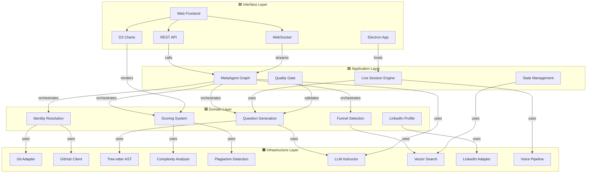

# Relation Map

> 전체 아키텍처 컴포넌트 간 의존성 시각화.

## 의존성 그래프



## 범례

| 색상 | 계층 | 의존 방향 |
|------|------|----------|
| 🟦 파랑 | Domain | Infrastructure를 사용 (Port/Adapter) |
| 🟩 초록 | Application | Domain + Infrastructure 오케스트레이션 |
| 🟧 주황 | Infrastructure | 외부 서비스 어댑터 (의존 받기만) |
| 🟪 보라 | Interface | Application 호출 (진입점) |

## Dataview: 관계 밀도

```dataview
TABLE length(depends-on) as "의존", length(affects) as "영향"
FROM "docs/architecture"
WHERE type != "moc" AND type != "adr"
SORT length(depends-on) + length(affects) DESC
LIMIT 20
```
