# HMAS Graph

> 3-Level Hierarchical Multi-Agent System. MetaAgent(Level 1)가 Supervisor(Level 2)를 오케스트레이션하고, Supervisor가 Worker(Level 3)를 관리하는 LangGraph StateGraph 기반 분석 파이프라인이다.

## 아키텍처 개요

```mermaid
graph TB
    subgraph "Level 1: MetaAgent"
        IR[InputRouter] --> PG[PlanGenerator]
        PG --> FS[ForensicSupervisor]
        PG --> LS[LogicSupervisor]
        LS --> SS[StackSupervisor]
        FS --> PS[ProfileSynthesizer]
        SS --> PS
        PS --> QO[QuestionOrchestrator]
        QO --> QG[QualityGate]
        QG -->|revise| QO
        QG -->|approve| OA[OutputAssembler]
    end

    subgraph "Level 2: ForensicSupervisor"
        W1[W1: Collector] --> W2[W2: IdentityResolver]
        W2 --> W2b[SemanticPruner]
        W2b --> W3[W3: Vibector]
        W2b --> W4[W4: CLAVE]
        W2b --> W5[W5: Datasketch]
    end

    subgraph "Level 2: LogicSupervisor"
        W6[W6: ASTAnalyzer]
        W7[W7: ComplexityMeter]
        W8[W8: QualityScanner]
    end

    subgraph "Level 2: StackSupervisor"
        W9[W9: SkillExtractor]
        W10[W10: APIDepthAnalyzer]
        W11[W11: ArchitectureEvaluator]
    end
```



## 핵심 제약

| 제약 | 설명 |
|------|------|
| ForensicSupervisor // LogicSupervisor | 완전 병렬 실행 |
| StackSupervisor -> LogicSupervisor | AST 결과 의존으로 Logic 완료 후 실행 |
| QualityGate 루프 | 최대 2회 재생성 (`revision_count < 2`) |
| Reference Passing | State에 Raw Data 금지 -- DB ID만 전달 ([[state-management/reference-passing\|ADR-0004]]) |

## 하위 문서

```dataview
TABLE title, status, type
FROM "docs/architecture/application/hmas-graph"
WHERE type = "component"
SORT file.name ASC
```

## 관련 Linear 티켓

| 티켓 | 제목 |
|------|------|
| JIT-100 | State 정의 (MetaState, ForensicState, LogicState, StackState) |
| JIT-101 | ForensicSupervisor Graph |
| JIT-102 | LogicSupervisor Graph |
| JIT-103 | StackSupervisor Graph |
| JIT-104 | MetaAgent Graph 조립 |
| JIT-105 | FastAPI + WebSocket 통합 |

## 소스

- `plan/v5-design/phase3-application.md` SS6, SS10
- `plan/2026-02-15-v5-final-design.md` SS6.2
