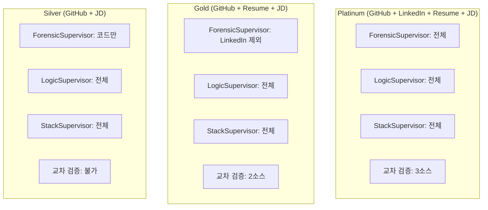
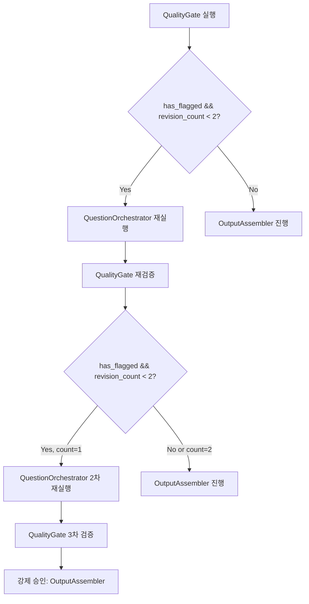

# Conditional Edges

> MetaAgent Graph에서 조건 분기가 발생하는 두 지점: (1) InputRouter의 **데이터 가용성 기반 라우팅**과 (2) QualityGate의 **품질 검증 루프**. 가용한 데이터 소스에 따라 분석 깊이가 달라지고, 품질 미달 시 최대 2회 재생성한다.

## 1. InputRouter: 데이터 가용성 Tier

InputRouter는 입력 데이터의 종류와 양에 따라 분석 깊이를 결정한다. PlanGenerator가 이 정보를 바탕으로 실행 계획을 동적으로 생성한다.

### Tier 정의

| Tier | 가용 데이터 | 분석 범위 | 신뢰도 |
|------|-----------|----------|--------|
| **Platinum** | GitHub + LinkedIn + 이력서 + JD | 전체 Worker 실행 (W1~W11) | 높음 |
| **Gold** | GitHub + 이력서 + JD | LinkedIn Worker 건너뜀, 교차 검증 제한 | 중간 |
| **Silver** | GitHub + JD | 이력서/LinkedIn 없음, 코드 분석 중심 | 기본 |

### InputRouter 라우팅 로직

```python
# application/nodes/input_router.py
async def input_router_node(state: MetaState) -> dict:
    """입력 파싱 + 데이터 가용성 Tier 결정"""
    input_data = await job_repository.get(state["job_id"])

    # 데이터 가용성 판별
    has_github = bool(input_data.get("github_urls"))
    has_linkedin = bool(input_data.get("linkedin_url"))
    has_resume = bool(input_data.get("resume_file"))
    has_jd = bool(input_data.get("jd_content"))

    if has_github and has_linkedin and has_resume and has_jd:
        tier = "platinum"
    elif has_github and has_resume and has_jd:
        tier = "gold"
    elif has_github and has_jd:
        tier = "silver"
    else:
        raise InsufficientDataError("GitHub URL과 JD는 필수입니다")

    return {
        "input_data_ref": str(input_data["id"]),
        "status": "routed",
        "data_tier": tier,
    }
```

### PlanGenerator의 Tier 기반 계획 생성

```python
# application/nodes/plan_generator.py
async def plan_generator_node(state: MetaState) -> dict:
    """데이터 Tier에 따라 Worker 실행 계획 동적 생성"""
    tier = state.get("data_tier", "silver")

    plan = {
        "forensic_workers": ["collector", "identity_resolver", "semantic_pruner",
                             "vibector", "clave", "datasketch"],
        "logic_workers": ["ast_analyzer", "complexity_meter", "quality_scanner"],
        "stack_workers": ["skill_extractor", "api_depth_analyzer",
                          "architecture_evaluator"],
    }

    # Tier에 따른 조정
    if tier == "silver":
        # LinkedIn, 이력서 교차 검증 건너뜀
        plan["skip_crossref"] = True
    elif tier == "gold":
        # LinkedIn 관련 분석 건너뜀
        plan["skip_linkedin"] = True

    return {"status": "planned", "execution_plan": plan}
```

### Tier별 분석 차이



## 2. QualityGate: 품질 검증 루프

QualityGate는 MetaAgent의 유일한 `add_conditional_edges` 분기점이다.

### should_revise 판별 함수

```python
# application/nodes/quality_gate.py
def should_revise(state: MetaState) -> str:
    """품질 검증 결과에 따라 revise 또는 approve 결정"""
    if state["revision_count"] < 2 and has_flagged_issues(state):
        return "revise"
    return "approve"
```

### 분기 조건 상세



### Graph 등록

```python
builder.add_conditional_edges(
    "quality_gate",
    should_revise,  # revision_count < 2 && has_flagged
    {"revise": "question_orchestrator", "approve": "output_assembler"},
)
```

### 품질 검증 기준 (has_flagged 조건)

| 검증 항목 | 기준 | 위반 시 |
|----------|------|--------|
| JD 관련성 | 모든 질문이 JD 요구사항과 연결 | flag |
| 코드 레퍼런스 정확성 | 참조된 파일:라인이 실제 코드와 일치 | flag |
| 비개발자 이해도 | 용어 설명 + 답변 가이드 포함 | flag |
| 3전략 균형 | Negative/Complexity/Evolution 편중 방지 | flag |
| 중복 질문 | 의미적 유사도 기반 중복 감지 | flag |

### revision_count 흐름

```
초기: revision_count = 0
  -> QualityGate 1차: flag 발견 -> revise -> revision_count = 1
  -> QualityGate 2차: flag 발견 -> revise -> revision_count = 2
  -> QualityGate 3차: revision_count >= 2 -> 강제 approve (루프 종료)
```

## MetaState 내 Flow Control 필드

```python
class MetaState(TypedDict):
    # ...
    status: str              # routed | planned | analyzing | synthesized | ...
    revision_count: int      # QualityGate 루프 카운터 (최대 2)
    errors: list[str]        # 에러 누적 (분석 중 발생한 비치명적 오류)
```

## 관련 문서

- [[hmas-graph/meta-agent]] -- conditional_edges 등록 위치
- [[quality-gate/review-loop]] -- QualityGate 품질 검증 기준 상세
- [[hmas-graph/execution-flow]] -- 전체 실행 흐름 시퀀스
- [[state-management/meta-state]] -- MetaState 필드 정의
