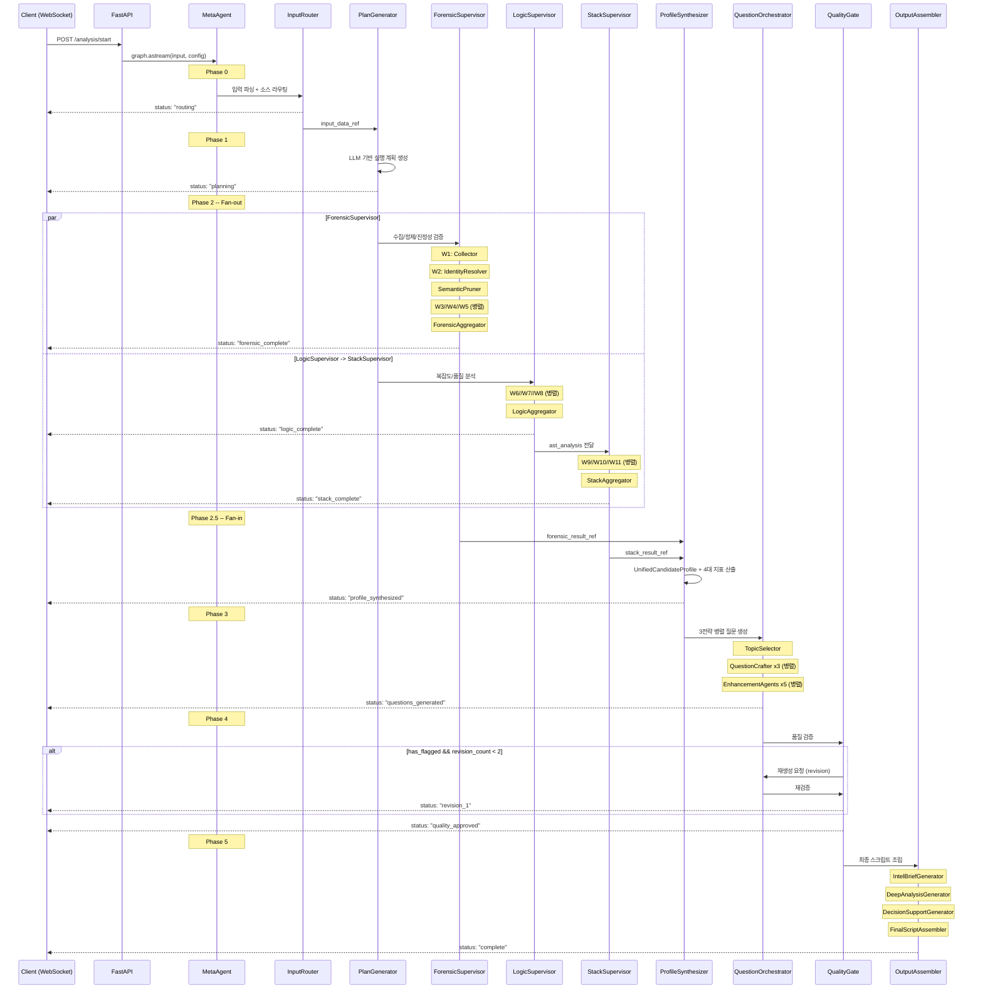
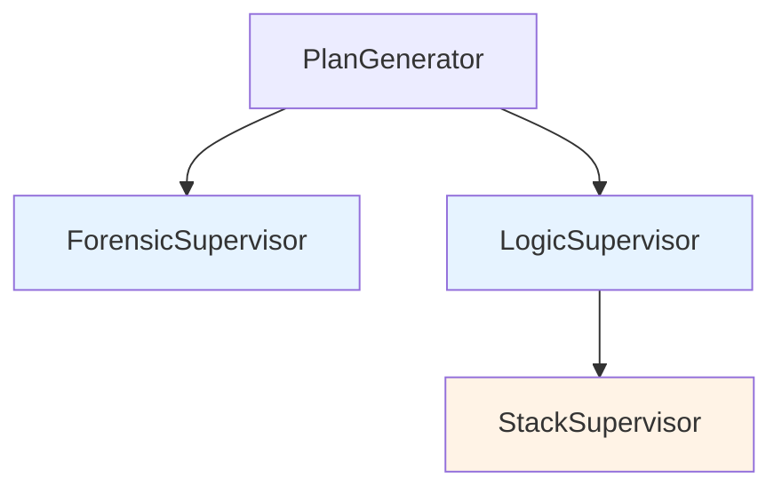
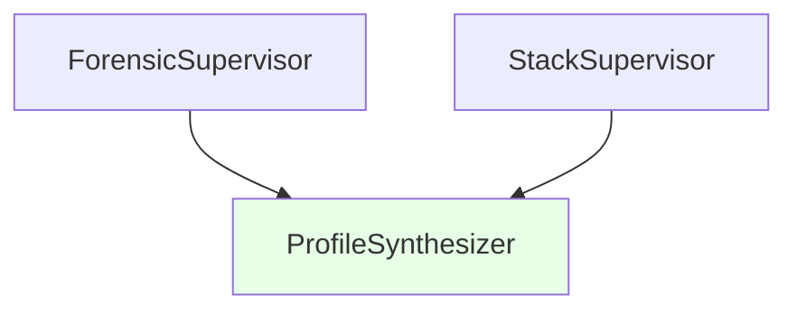

# HMAS Execution Flow

> MetaAgent의 전체 실행 흐름을 Mermaid 시퀀스 다이어그램으로 표현한다. Fan-out/Fan-in 패턴과 병렬/순차 실행의 타이밍을 시각화한다.

## 전체 시퀀스 다이어그램



## Fan-out/Fan-in 상세

### Fan-out (Phase 2)

PlanGenerator 완료 후 ForensicSupervisor와 LogicSupervisor가 **동시에** 시작한다.



| 실행 | 상태 | 의존 |
|------|------|------|
| ForensicSupervisor | 병렬 시작 | PlanGenerator 완료만 필요 |
| LogicSupervisor | 병렬 시작 | PlanGenerator 완료만 필요 |
| StackSupervisor | 순차 시작 | LogicSupervisor 완료 필요 (AST 의존) |

### Fan-in (Phase 2.5)

ProfileSynthesizer는 ForensicSupervisor와 StackSupervisor **모두** 완료되어야 실행된다. LangGraph의 Fan-in은 모든 incoming edge의 노드가 완료될 때까지 자동 대기한다.



## 실행 타임라인 (예상)

```
Time ─────────────────────────────────────────────────────────>

Phase 0-1 (순차):
|-- InputRouter --|-- PlanGenerator --|

Phase 2 (병렬 + 순차):
                                      |==== ForensicSupervisor (W1->W2->Pruner->[W3//W4//W5]) ====|
                                      |==== LogicSupervisor ([W6//W7//W8]) ====|
                                                                                |== StackSupervisor ([W9//W10//W11]) ==|

Phase 2.5 (Fan-in):
                                                                                                                       |-- ProfileSynthesizer --|

Phase 3-4 (순차 + 루프):
                                                                                                                                                 |-- QuestionOrchestrator --|-- QualityGate --|
                                                                                                                                                                                               |?-- QO (revision) --|?-- QG --|

Phase 5 (순차):
                                                                                                                                                                                                                               |-- OutputAssembler --|
```

## WebSocket 이벤트 스트리밍

MetaAgent Graph를 `stream_mode="updates"`로 실행하면 각 노드 완료 시 이벤트가 발생한다.

```python
async for event in graph.astream(input_data, config, stream_mode="updates"):
    # event 구조:
    # {"node_name": {"field": "value", ...}}
    await ws_manager.broadcast(job_id, event)
```

클라이언트는 WebSocket을 통해 실시간으로 진행 상태를 수신한다:

| 이벤트 | 발생 시점 |
|--------|----------|
| `input_router` | 입력 파싱 완료 |
| `plan_generator` | 실행 계획 생성 완료 |
| `forensic_supervisor` | 포렌식 분석 완료 |
| `logic_supervisor` | 로직 분석 완료 |
| `stack_supervisor` | 스택 분석 완료 |
| `profile_synthesizer` | 프로필 통합 완료 |
| `question_orchestrator` | 질문 생성 완료 |
| `quality_gate` | 품질 검증 완료 (approve/revise) |
| `output_assembler` | 최종 출력 완료 |

## 관련 문서

- [[hmas-graph/meta-agent]] -- Level 1 Graph 구현 코드
- [[hmas-graph/conditional-edges]] -- QualityGate 분기 로직
- [[state-management/reference-passing]] -- 노드 간 데이터 전달 패턴
