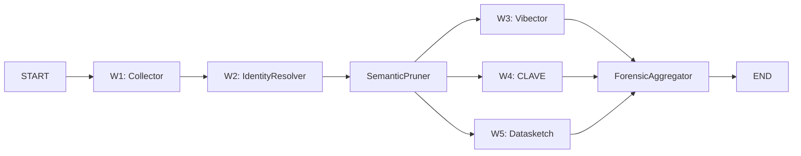

# ForensicSupervisor Graph (Level 2)

> 코드 수집, Identity Resolution, 노이즈 제거, 진정성 검증을 수행하는 Supervisor. W1~W5까지 5개 Worker를 순차+병렬 조합으로 실행한다.

## ForensicState TypedDict

```python
# application/graphs/forensic_graph.py
class ForensicState(TypedDict):
    github_urls: list[str]
    candidate_username: str | None
    linkedin_url: str | None
    jd_languages: list[str]
    jd_tech_stack: list[str]

    # Worker 결과
    collected_repos: list[dict]
    identity_cluster: dict
    blame_attributions: list[dict]
    pure_contributions: list[dict]
    cleaned_diffs: list[dict]
    vibector_scores: list[dict]
    clave_fingerprint: dict
    plagiarism_report: dict

    # 통합
    forensic_summary: dict
    authenticity_score: float
```

## Worker 구성 (W1~W5)

| # | Worker | 도구 | 역할 | 입력 | 출력 |
|---|--------|------|------|------|------|
| W1 | CollectorWorker | GitHub GraphQL, PyDriller | 레포지토리 수집 + Funnel Stage 1-3 | `github_urls` | `collected_repos` |
| W2 | IdentityResolver | .mailmap, git blame | Identity Resolution + Blame 필터링 | `collected_repos` | `identity_cluster`, `blame_attributions` |
| W2b | SemanticPruner | Tree-sitter AST | 노이즈 제거 (import, 주석, config, generated) | `blame_attributions` | `pure_contributions`, `cleaned_diffs` |
| W3 | VibectorWorker | WPM 계산 | AI 코드 의심 구간 탐지 (타이핑 속도 분석) | `cleaned_diffs` | `vibector_scores` |
| W4 | CLAVEWorker | 스타일로메트리 | 저자 지문 생성 + 일관성 분석 | `cleaned_diffs` | `clave_fingerprint` |
| W5 | DatasketchWorker | MinHash/LSH | 외부 코드 대비 표절 탐지 | `cleaned_diffs` | `plagiarism_report` |

## 실행 순서



**핵심 패턴:**
1. **순차 구간** (W1 -> W2 -> SemanticPruner): 각 단계의 출력이 다음 단계의 필수 입력
2. **병렬 구간** (W3 // W4 // W5): SemanticPruner의 `cleaned_diffs`를 공유 입력으로 독립 실행
3. **Fan-in** (ForensicAggregator): 3개 Worker 결과를 `forensic_summary` + `authenticity_score`로 취합

## Graph 구현

```python
# application/graphs/forensic_graph.py
def build_forensic_graph() -> StateGraph:
    builder = StateGraph(ForensicState)

    builder.add_node("collector", collector_worker)          # GraphQL + Funnel Stage 1-3
    builder.add_node("identity_resolver", identity_resolver) # Mailmap + Blame
    builder.add_node("semantic_pruner", semantic_pruner)      # Tree-sitter AST pruning
    builder.add_node("vibector", vibector_worker)             # WPM 분석
    builder.add_node("clave", clave_worker)                   # 스타일로메트리
    builder.add_node("datasketch", datasketch_worker)         # 표절 탐지
    builder.add_node("forensic_aggregator", forensic_aggregator)

    # 순차: collector -> identity_resolver -> semantic_pruner
    builder.add_edge(START, "collector")
    builder.add_edge("collector", "identity_resolver")
    builder.add_edge("identity_resolver", "semantic_pruner")

    # 병렬: pruner 후 진정성 검증 3개 동시
    builder.add_edge("semantic_pruner", "vibector")
    builder.add_edge("semantic_pruner", "clave")
    builder.add_edge("semantic_pruner", "datasketch")

    # Fan-in
    builder.add_edge("vibector", "forensic_aggregator")
    builder.add_edge("clave", "forensic_aggregator")
    builder.add_edge("datasketch", "forensic_aggregator")

    return builder
```

## 결과 취합 (ForensicAggregator)

ForensicAggregator는 3개 진정성 검증 결과를 통합하여 최종 `authenticity_score`를 산출한다.

```
authenticity_score 산출 로직:
  - vibector_scores: AI 코드 비율 (높을수록 의심)
  - clave_fingerprint: 저자 일관성 점수 (낮을수록 의심)
  - plagiarism_report: 표절 유사도 (높을수록 의심)

  -> 가중 평균으로 0.0~1.0 authenticity_score 산출
  -> forensic_summary에 각 Worker별 상세 결과 포함
```

## 의존 관계

- **MetaAgent에서 호출**: `plan_generator` -> `forensic_supervisor` (Fan-out)
- **LogicSupervisor와 병렬 실행**: 상호 의존 없음
- **결과 전달**: `forensic_result_ref` -> `profile_synthesizer` (Fan-in)

## 관련 문서

- [[domain/identity-resolution/MOC]] -- W2 IdentityResolver의 3단계 파이프라인
- [[infrastructure/plagiarism-detection/MOC]] -- W5 Datasketch MinHash/LSH
- [[infrastructure/tree-sitter-ast/MOC]] -- SemanticPruner의 AST 노이즈 제거
- [[hmas-graph/meta-agent]] -- Level 1 오케스트레이터
- [[hmas-graph/execution-flow]] -- 전체 실행 흐름도
