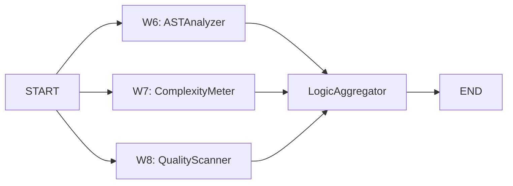

# LogicSupervisor Graph (Level 2)

> W6~W8 3개 Worker를 **완전 병렬**로 실행하여 코드의 구조적 품질을 분석하는 Supervisor. AST 분석, 복잡도 측정, 품질 스캔을 동시에 수행한다.

## LogicState TypedDict

```python
# application/graphs/logic_graph.py
class LogicState(TypedDict):
    cleaned_diffs: list[dict]
    repo_paths: list[str]
    ast_analysis: list[dict]
    complexity_metrics: list[dict]
    quality_report: dict
    logic_summary: dict
    logic_score: float
```

## Worker 구성 (W6~W8) -- 완전 병렬

| # | Worker | 도구 | 역할 | 입력 | 출력 |
|---|--------|------|------|------|------|
| W6 | ASTAnalyzerWorker | Tree-sitter 0.24+ | 의미론적 코드 분석 (함수, 클래스, 패턴 추출) | `repo_paths` | `ast_analysis` |
| W7 | ComplexityMeterWorker | Radon 6.0+, Lizard 1.17+ | Cyclomatic Complexity, Halstead, MI 산출 | `repo_paths` | `complexity_metrics` |
| W8 | QualityScannerWorker | SonarQube Community | 기술 부채, 코드 스멜, 취약점 스캔 | `repo_paths` | `quality_report` |

## 실행 흐름



**핵심 패턴:** 3개 Worker가 **START에서 동시 시작** -- 상호 의존 없이 독립적으로 분석 수행 후 LogicAggregator에서 Fan-in.

## Graph 구현

```python
# application/graphs/logic_graph.py
def build_logic_graph() -> StateGraph:
    builder = StateGraph(LogicState)
    builder.add_node("ast_analyzer", ast_analyzer_worker)
    builder.add_node("complexity_meter", complexity_meter_worker)
    builder.add_node("quality_scanner", quality_scanner_worker)
    builder.add_node("logic_aggregator", logic_aggregator)

    # 3개 Worker 완전 병렬
    builder.add_edge(START, "ast_analyzer")
    builder.add_edge(START, "complexity_meter")
    builder.add_edge(START, "quality_scanner")
    builder.add_edge("ast_analyzer", "logic_aggregator")
    builder.add_edge("complexity_meter", "logic_aggregator")
    builder.add_edge("quality_scanner", "logic_aggregator")
    return builder
```

## 결과 취합 (LogicAggregator)

```
LogicAggregator 산출:
  - ast_analysis: 함수/클래스 구조, 디자인 패턴 감지, 의존성 그래프
  - complexity_metrics: CC, Halstead(D, V, E), MI per file/function
  - quality_report: 기술 부채(일 단위), 코드 스멜, 보안 취약점

  -> logic_summary: 통합 코드 품질 리포트
  -> logic_score: 0.0~1.0 정규화 점수
```

## StackSupervisor 의존성

LogicSupervisor의 `ast_analysis` 결과는 StackSupervisor의 3개 Worker(W9~W11)가 필수적으로 사용한다.

```
LogicSupervisor 완료
    |
    v
StackSupervisor 시작
    ├── SkillExtractor: ast_analysis 기반 기술 매핑
    ├── APIDepthAnalyzer: ast_analysis의 Call Graph 활용
    └── ArchitectureEvaluator: ast_analysis의 패턴 분석 활용
```

MetaAgent Graph에서 이 의존성은 다음 Edge로 표현된다:
```python
builder.add_edge("logic_supervisor", "stack_supervisor")  # AST 의존
```

## 관련 문서

- [[infrastructure/tree-sitter-ast/MOC]] -- W6 ASTAnalyzer의 Tree-sitter 0.24 구현
- [[infrastructure/complexity-analysis/MOC]] -- W7 ComplexityMeter의 Radon/Lizard 통합
- [[hmas-graph/stack-supervisor]] -- Logic 완료 후 실행되는 StackSupervisor
- [[hmas-graph/meta-agent]] -- Level 1 오케스트레이터
