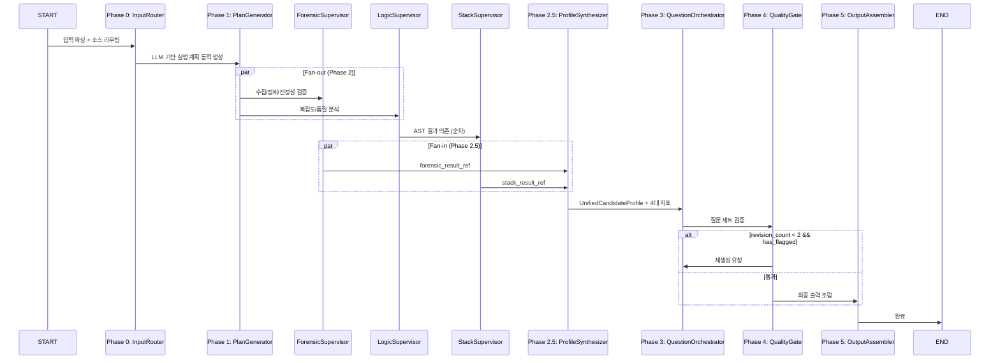

# MetaAgent Graph (Level 1)

> 전체 분석 파이프라인의 총괄 오케스트레이터. 5개 Phase를 순차/병렬로 실행하며 3개 Supervisor Subgraph를 Fan-out/Fan-in 패턴으로 조율한다.

## MetaState TypedDict

모든 Phase를 관통하는 공유 상태. [[state-management/reference-passing|Reference Passing]] 원칙에 따라 DB ID만 저장한다.

```python
# application/states/meta_state.py
from typing import TypedDict, Optional

class MetaState(TypedDict):
    # Core Context
    job_id: str

    # References (Not Raw Data -- DB ID만 전달)
    input_data_ref: str                          # jobs 테이블 ID
    identity_cluster_ref: Optional[str]          # identity_resolutions 테이블 ID

    # Analysis Result References (analysis_results 테이블 ID)
    forensic_result_ref: Optional[str]
    logic_result_ref: Optional[str]
    stack_result_ref: Optional[str]

    # Metrics (가벼우므로 State에 포함 가능)
    candidate_scores: Optional[dict]             # 4대 지표 점수

    # Flow Control
    status: str
    revision_count: int                          # 최대 2회 루프
    errors: list[str]
```

### 필드 분류

| 분류 | 필드 | 크기 | 설명 |
|------|------|------|------|
| Core | `job_id` | UUID (36B) | 분석 작업 고유 ID |
| Reference | `input_data_ref` | UUID | jobs 테이블 FK |
| Reference | `identity_cluster_ref` | UUID | Identity Resolution 결과 |
| Reference | `forensic_result_ref` | UUID | ForensicSupervisor 결과 |
| Reference | `logic_result_ref` | UUID | LogicSupervisor 결과 |
| Reference | `stack_result_ref` | UUID | StackSupervisor 결과 |
| Inline | `candidate_scores` | ~수 KB | 4대 지표 (충분히 작음) |
| Control | `status`, `revision_count`, `errors` | 수 B | 흐름 제어 |

## 5개 Phase 흐름



## Graph 구현

```python
# application/graphs/meta_graph.py
from langgraph.graph import StateGraph, START, END
from langgraph.checkpoint.postgres.aio import AsyncPostgresSaver

def build_meta_graph() -> StateGraph:
    builder = StateGraph(MetaState)

    # 노드 등록
    builder.add_node("input_router", input_router_node)
    builder.add_node("plan_generator", plan_generator_node)
    builder.add_node("forensic_supervisor", forensic_subgraph)
    builder.add_node("logic_supervisor", logic_subgraph)
    builder.add_node("stack_supervisor", stack_subgraph)
    builder.add_node("profile_synthesizer", profile_synthesizer_node)
    builder.add_node("question_orchestrator", question_subgraph)
    builder.add_node("quality_gate", quality_gate_node)
    builder.add_node("output_assembler", output_assembler_node)

    # Phase 0-1: 순차
    builder.add_edge(START, "input_router")
    builder.add_edge("input_router", "plan_generator")

    # Phase 2: Fan-out (ForensicSuper || LogicSuper -> StackSuper)
    builder.add_edge("plan_generator", "forensic_supervisor")
    builder.add_edge("plan_generator", "logic_supervisor")
    builder.add_edge("logic_supervisor", "stack_supervisor")  # AST 의존

    # Phase 2.5: Fan-in
    builder.add_edge("forensic_supervisor", "profile_synthesizer")
    builder.add_edge("stack_supervisor", "profile_synthesizer")

    # Phase 3-4: 순차 + 조건부 루프
    builder.add_edge("profile_synthesizer", "question_orchestrator")
    builder.add_edge("question_orchestrator", "quality_gate")

    builder.add_conditional_edges(
        "quality_gate",
        should_revise,  # revision_count < 2 && has_flagged
        {"revise": "question_orchestrator", "approve": "output_assembler"},
    )

    # Phase 5: 최종 출력
    builder.add_edge("output_assembler", END)

    return builder
```

## FastAPI 통합

```python
# interface/api/routes/jobs.py
from langgraph.checkpoint.postgres.aio import AsyncPostgresSaver

async def run_analysis(job_id: str, input_data: dict):
    async with AsyncPostgresSaver.from_conn_string(DB_URI) as checkpointer:
        graph = build_meta_graph().compile(checkpointer=checkpointer)
        config = {"configurable": {"thread_id": job_id}}

        async for event in graph.astream(input_data, config, stream_mode="updates"):
            # WebSocket으로 실시간 전송
            await ws_manager.broadcast(job_id, event)
```

## Phase별 역할 요약

| Phase | 노드 | 역할 | 입력 | 출력 |
|-------|------|------|------|------|
| 0 | InputRouter | 입력 파싱, 소스 유효성 검증 | Raw 입력 (JD, GitHub URL 등) | `input_data_ref` |
| 1 | PlanGenerator | LLM 기반 실행 계획 동적 생성 | `input_data_ref` | 실행 계획 |
| 2 | Forensic/Logic/StackSupervisor | 병렬 분석 (Fan-out/Fan-in) | refs | `*_result_ref` |
| 2.5 | ProfileSynthesizer | 모든 분석 결과 통합 | `*_result_ref` | `candidate_scores` |
| 3 | QuestionOrchestrator | 3전략 병렬 질문 생성 | profile + scores | 질문 세트 |
| 4 | QualityGate | 품질 검증 + 조건부 루프 | 질문 세트 | approve / revise |
| 5 | OutputAssembler | 최종 스크립트 조립 | 질문 세트 + scores | 인터뷰 스크립트 |

## 관련 문서

- [[hmas-graph/forensic-supervisor]] -- Level 2 수집/정제/진정성 검증
- [[hmas-graph/logic-supervisor]] -- Level 2 복잡도/품질 분석
- [[hmas-graph/stack-supervisor]] -- Level 2 전문성/스택 분석
- [[hmas-graph/execution-flow]] -- 전체 Fan-out/Fan-in 시퀀스 다이어그램
- [[hmas-graph/conditional-edges]] -- 데이터 가용성 분기 로직
- [[state-management/meta-state]] -- MetaState TypedDict 상세
