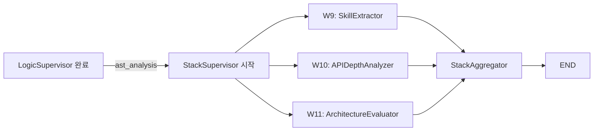

# StackSupervisor Graph (Level 2)

> W9~W11 3개 Worker를 **완전 병렬**로 실행하여 후보자의 기술 전문성과 아키텍처 역량을 평가하는 Supervisor. **LogicSupervisor 완료 후 시작** -- AST 분석 결과에 의존한다.

## StackState TypedDict

```python
# application/graphs/stack_graph.py
class StackState(TypedDict):
    ast_analysis: list[dict]    # LogicSupervisor에서 전달
    cleaned_diffs: list[dict]
    jd_tech_stack: list[str]
    skill_extraction: dict
    api_depth_scores: list[dict]
    architecture_eval: dict
    stack_summary: dict
    mastery_score: float
```

## Worker 구성 (W9~W11) -- 완전 병렬

| # | Worker | 도구 | 역할 | 입력 | 출력 |
|---|--------|------|------|------|------|
| W9 | SkillExtractorWorker | AST + LLM | JD 기반 기술 매핑 -- 코드에서 실제 사용된 기술 추출 | `ast_analysis`, `jd_tech_stack` | `skill_extraction` |
| W10 | APIDepthAnalyzerWorker | AST Call Graph | API 활용 깊이 분석 -- 표면 호출 vs 심층 활용 구분 | `ast_analysis` | `api_depth_scores` |
| W11 | ArchitectureEvaluatorWorker | AST 패턴 | SOLID 원칙 준수, 디자인 패턴 식별, 아키텍처 평가 | `ast_analysis`, `cleaned_diffs` | `architecture_eval` |

## AST 의존성

LogicSupervisor의 `ast_analysis` 결과가 StackSupervisor의 3개 Worker 모두에 필요하다.



**의존 근거:** SkillExtractor는 AST에서 추출된 함수/클래스 구조를 기반으로 기술 매핑을 수행한다. APIDepthAnalyzer는 AST의 Call Graph를 분석하여 API 활용 깊이를 측정한다. ArchitectureEvaluator는 AST 패턴에서 SOLID 원칙 준수 여부를 판별한다. 세 Worker 모두 Tree-sitter가 파싱한 구조적 데이터를 필수 입력으로 사용하므로, LogicSupervisor(W6: ASTAnalyzer) 완료 없이는 실행 불가하다.

## Graph 구현

```python
# application/graphs/stack_graph.py
def build_stack_graph() -> StateGraph:
    builder = StateGraph(StackState)
    builder.add_node("skill_extractor", skill_extractor_worker)
    builder.add_node("api_depth_analyzer", api_depth_analyzer_worker)
    builder.add_node("architecture_evaluator", architecture_evaluator_worker)
    builder.add_node("stack_aggregator", stack_aggregator)

    # 3개 Worker 완전 병렬
    builder.add_edge(START, "skill_extractor")
    builder.add_edge(START, "api_depth_analyzer")
    builder.add_edge(START, "architecture_evaluator")
    builder.add_edge("skill_extractor", "stack_aggregator")
    builder.add_edge("api_depth_analyzer", "stack_aggregator")
    builder.add_edge("architecture_evaluator", "stack_aggregator")
    return builder
```

## 결과 취합 (StackAggregator)

```
StackAggregator 산출:
  - skill_extraction: JD 기술 매핑 (기술별 증거 + 깊이 수준)
  - api_depth_scores: API별 활용 깊이 (표면 / 중급 / 심층)
  - architecture_eval: 아키텍처 점수 (SOLID 준수도, 패턴 활용도)

  -> stack_summary: 통합 전문성 리포트
  -> mastery_score: 0.0~1.0 기술 숙련도 점수
```

## MetaAgent에서의 위치

```
PlanGenerator
    |
    +-- ForensicSupervisor (병렬)
    |
    +-- LogicSupervisor (병렬)
            |
            v
        StackSupervisor (Logic 완료 후)
            |
            v
        ProfileSynthesizer (Fan-in: Forensic + Stack 모두 완료 대기)
```

ForensicSupervisor와 StackSupervisor가 모두 완료되어야 ProfileSynthesizer가 실행된다.

## 관련 문서

- [[hmas-graph/logic-supervisor]] -- AST 결과를 제공하는 선행 Supervisor
- [[hmas-graph/meta-agent]] -- Level 1 오케스트레이터
- [[hmas-graph/execution-flow]] -- 전체 Fan-out/Fan-in 시퀀스
- [[infrastructure/tree-sitter-ast/MOC]] -- AST 파서 구현
