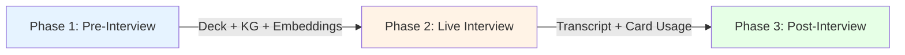

# Live Session

> 실시간 AI 면접 가이드 엔진. Pre-Interview(LangGraph) -> Live Interview(비-LangGraph 로컬 엔진) -> Post-Interview(LangGraph) 3-Phase로 구성된다. Layer 1(사전 생성 Deck) + Layer 2(실시간 Probing) 2계층 질문 시스템으로 면접관의 인지 부하를 최소화한다.

## 3-Phase 아키텍처



| Phase | 실행 위치 | 엔진 | 역할 |
|-------|----------|------|------|
| Pre-Interview | 서버 (LangGraph) | MetaAgent HMAS | 분석 + Deck 생성 + 벡터 임베딩 |
| Live Interview | 클라이언트 (Local-First) | 비-LangGraph 로컬 엔진 | 실시간 STT + RAG + 질문 생성 |
| Post-Interview | 서버 (LangGraph) | Evaluator + Ranker + Reporter | 스코어카드 + 리포트 생성 |

## 하위 문서

```dataview
TABLE title, status, type
FROM "docs/architecture/application/live-session"
WHERE type = "component"
SORT file.name ASC
```

## 관련 Linear 티켓

| 티켓 | 제목 |
|------|------|
| JTL-60 | LangGraph MetaAgent 그래프 |
| JTL-61 | DeckGenerator 서비스 |
| JTL-62 | 실시간 분석 파이프라인 |
| JTL-63 | PostInterview 분석 파이프라인 |
| JTL-73 | STT + RAG + LLM 파이프라인 통합 |

## 소스

- `jittda_doc/jittda_live_brainstorm_curated.md` -- 3-Phase 설계 + UI/UX
- `plan/v5-design/phase3-application.md` -- HMAS Graph 연동
