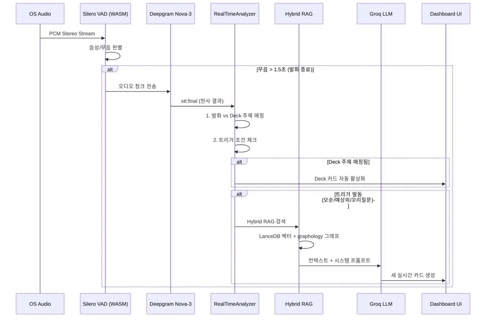

# Live Interview Engine (Phase 2)

> 비-LangGraph 로컬 엔진. Electron 클라이언트에서 **Local-First**로 동작하며, 실시간 오디오 캡처 -> VAD -> STT -> RAG 검색 -> LLM 질문 생성을 수행한다. 서버 의존을 최소화하여 네트워크 장애 시에도 면접이 가능하다.

## 3-Layer 아키텍처

```
+-------------------------------------------------------------+
|  Electron Renderer Process (React 19 + Tailwind)             |
|                                                              |
|  [면접관 대시보드 UI]                                          |
|   Zone A: 상태 바 (시간, 마이크, 종료 가능 여부)                |
|   Zone B: 질문 카드 (Layer 1 Deck + Layer 2 실시간)           |
|   Zone C: 커버리지 + 컨트롤                                   |
|                                                              |
|  [VAD Engine]  [STT Client]  [RealTimeAnalyzer]              |
|  Silero WASM    Deepgram WS   발화 분석 + 트리거              |
+-------------------------------------------------------------+
          |  IPC (Inter-Process Communication)
+-------------------------------------------------------------+
|  Electron Main Process (Node.js)                             |
|                                                              |
|  [Child Process Manager]  [Sync Service]  [LanceDB]         |
|  OS별 오디오 바이너리      서버 동기화      로컬 벡터 DB       |
|                                                              |
|  [graphology]             [Event Bus]                        |
|  In-memory KG             Pub/Sub 이벤트                     |
+-------------------------------------------------------------+
          |  Child Process (Native Binary)
+-------------------------------------------------------------+
|  OS Native Audio Capture                                     |
|  macOS: ScreenCaptureKit / CoreAudio                         |
|  Windows: WASAPI Loopback                                    |
+-------------------------------------------------------------+
```

## 실시간 파이프라인



## RealTimeAnalyzer

면접 중 실시간 분석의 핵심 컴포넌트. **매 발화마다 LLM을 호출하지 않는다** -- 트리거 조건 충족 시에만 호출하여 비용과 노이즈를 최소화한다.

```python
# domain/services/live_analyzer.py
class RealTimeAnalyzer:
    """발화 완료 시 트리거 조건 체크 후 조건부 LLM 호출"""

    async def on_utterance(self, segment: TranscriptSegment) -> Optional[QuestionCard]:
        # 1. 발화 내용 vs Deck 주제 매칭
        matched_topic = self.match_deck_topic(segment.text)
        if matched_topic:
            self.event_bus.emit("deck:activate", matched_topic)

        # 2. 트리거 조건 체크
        trigger = self.check_triggers(segment)
        if not trigger:
            return None  # LLM 호출 안 함

        # 3. 트리거 있을 때만 Hybrid RAG + LLM 호출
        context = await self.hybrid_rag.search(segment.text)
        card = await self.groq_llm.generate_probing_question(
            segment=segment,
            context=context,
            trigger=trigger,
        )
        return card
```

### 3가지 트리거 조건

| 트리거 | 상황 | 예시 |
|--------|------|------|
| **모순 감지** | 지원자 발화가 Deck/KG와 충돌 | "혼자 다 했다" vs 이력서 "팀 프로젝트" |
| **예상 외 주제** | Deck에 없는 기술/경험 언급 | Deck에 없는 "Kafka" 언급 |
| **꼬리 질문** | Deck 질문 사용 후 답변이 불충분 | 답변이 모호 -> 구체적 수치 요구 |

## Local-First 데이터

| 데이터 | 저장소 | 용도 |
|--------|--------|------|
| KG (그래프) | graphology (In-memory) | 모순 탐지, 관계 탐색, 교차 검증 |
| Embeddings | LanceDB (In-process) | 벡터 유사도 검색, 의미 매칭 |
| Question Deck | 로컬 파일 | 사전 생성 질문 즉시 표시 |

**Hybrid RAG**: 벡터 검색(LanceDB)과 그래프 탐색(graphology)을 결합하여 단일 쿼리로 의미적 유사도 + 관계 기반 결과를 반환한다.

## 서버 WebSocket 통신

실시간 면접 중 서버와의 통신은 **데이터 저장과 커버리지 재계산만** 담당한다. 질문 생성은 클라이언트에서 직접 처리한다.

```
Client -> Server:
  - transcript.segment: 전사 결과 저장
  - card.used: 카드 사용 기록
  - card.dismissed: 카드 무시 기록
  - coverage.manual_verify: 수동 검증 완료
  - interview.end: 면접 종료 트리거

Server -> Client:
  - coverage.updated: 커버리지 재계산 결과
  - report.ready: 리포트 생성 완료 알림
```

## 면접 세션 생명주기

```
[생성]       [동기화]       [진행중]        [분석중]       [완료]
CREATED --> SYNCING --> IN_PROGRESS --> ANALYZING --> COMPLETED
```

## 관련 문서

- [[live-session/pre-interview-graph]] -- Deck + KG 생성 (Phase 1)
- [[live-session/post-interview-graph]] -- 면접 후 분석 (Phase 3)
- [[live-session/three-layer-questions]] -- Layer 1/2 질문 계층
- [[infrastructure/voice-pipeline/MOC]] -- 오디오 캡처 + STT + VAD
