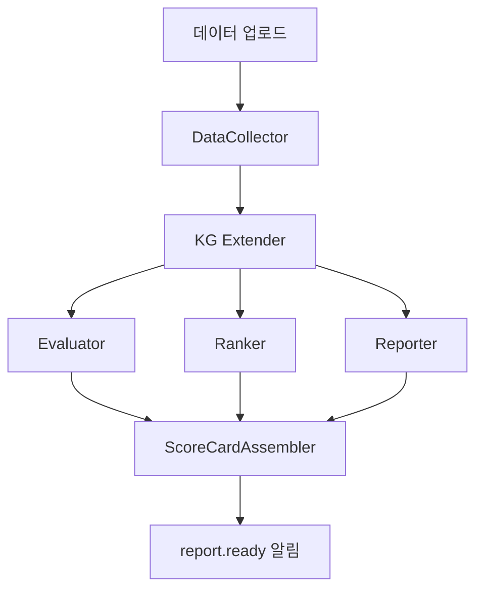
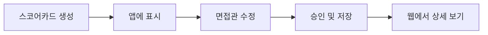

# Post-Interview Graph (Phase 3)

> 면접 종료 후 서버에서 실행되는 분석 파이프라인. 전체 트랜스크립트 + 카드 사용 이력 + 사전 분석 데이터를 통합하여 스코어카드와 리포트를 생성한다. Evaluator, Ranker, Reporter가 병렬로 실행된다.

## 트리거 조건

면접 종료(`interview.end` WebSocket 이벤트) 후 클라이언트가 데이터를 업로드하면 파이프라인이 시작된다.

```
POST /api/v1/sync/{session_id}/upload
  Body:
    - 전체 트랜스크립트 (화자 분리됨)
    - 카드 사용/무시 이력
    - 실시간 생성 카드 목록
    - 커버리지 최종 상태
```

## 파이프라인 구조



### 단계별 역할

| 단계 | 컴포넌트 | 역할 | 입력 | 출력 |
|------|---------|------|------|------|
| 1 | DataCollector | 면접 데이터 수집 + 정규화 | 업로드된 트랜스크립트, 카드 이력 | 통합 면접 데이터 |
| 2 | KG Extender | 면접 중 발견된 새 정보를 KG에 추가 | 트랜스크립트 + 기존 KG | 확장된 KG |
| 3a | Evaluator | 역량별 증거 기반 점수 산출 | 확장 KG + 트랜스크립트 | 역량별 점수 |
| 3b | Ranker | 같은 JD 지원자 간 비교 순위 | 확장 KG + 기존 평가 데이터 | 상대 순위 |
| 3c | Reporter | 위험 신호 + 타임라인 분석 | 트랜스크립트 + 카드 이력 | 리포트 데이터 |
| 4 | ScoreCardAssembler | 최종 스코어카드 조립 | 3a + 3b + 3c 결과 | Scorecard + Report |

## Evaluator: 역량 평가

```python
# 역량별 증거 매핑 구조
class CompetencyScore:
    competency: str         # "기술 역량", "문제 해결", "커뮤니케이션", "문화 적합성"
    score: float            # 1.0~5.0
    confidence: str         # HIGH / MEDIUM / LOW
    code_evidence: list     # 코드 분석 근거 (사전 분석)
    interview_evidence: list  # 면접 중 답변 근거
    unverified: list        # 미검증 항목
```

## Ranker: 지원자 비교

같은 JD에 지원한 다른 후보자가 있는 경우 상대 평가를 수행한다.

| 비교 항목 | 산출물 |
|----------|--------|
| 종합 순위 | 같은 포지션 지원자 중 순위 |
| 역량별 비교 | 기술 상위, 소프트 중위 등 |
| 차별점 | "유일하게 트러블슈팅 실전 사례 보유" 등 |

## Reporter: 위험 신호 + 타임라인

```python
# 리포트 산출물
class InterviewReport:
    # 위험 신호
    unresolved_contradictions: list   # 면접으로도 미해소된 모순점
    contradiction_severity: list      # HIGH / MEDIUM / LOW
    unverified_competencies: list     # 면접에서 미확인 JD 역량
    ai_code_understanding: str        # AI 코드 이해도 확인 여부

    # 타임라인 (D3.js 시각화용)
    topic_timeline: list              # 분 단위 주제 전환
    key_moments: list                 # 모순 발견, 강한/약한 답변 시점
    coverage_curve: list              # 시간별 커버리지 % 변화
    card_usage_timeline: list         # 질문 카드 사용/무시 시점

    # 권장 액션
    recommendation: str               # HIRE / NEXT_ROUND / REJECT
```

## 스코어카드 승인 플로우



면접관은 AI가 생성한 스코어카드를 확인 후 수정하거나 승인할 수 있다. 승인된 스코어카드는 `PATCH /api/v1/interviews/{id}/scorecard`로 서버에 저장된다.

## 최종 산출물

면접 1건 완료 시 생성되는 결과물:

1. **스코어카드**: 종합 점수(1.0-5.0), 권장 액션, 역량별 점수, 면접관 승인 이력
2. **수치 지표 (20+ 메트릭)**: 사전 분석 + 면접 중 + 사후 지표 통합
3. **증거 기반 평가서**: 역량별 (코드 + 면접) 증거 매핑, 위험 신호
4. **시각화 데이터 (D3.js)**: 역량 레이더, 면접 타임라인, 커버리지 곡선, 스킬-증거 트리맵
5. **전체 트랜스크립트**: 화자 분리, 핵심 순간 하이라이트, AI 분석 주석

## 관련 문서

- [[live-session/live-engine]] -- 면접 데이터를 생성하는 Phase 2
- [[live-session/pre-interview-graph]] -- 사전 분석 데이터 생성 Phase 1
- [[quality-gate/review-loop]] -- QualityGate (Pre-Interview 시 품질 검증)
