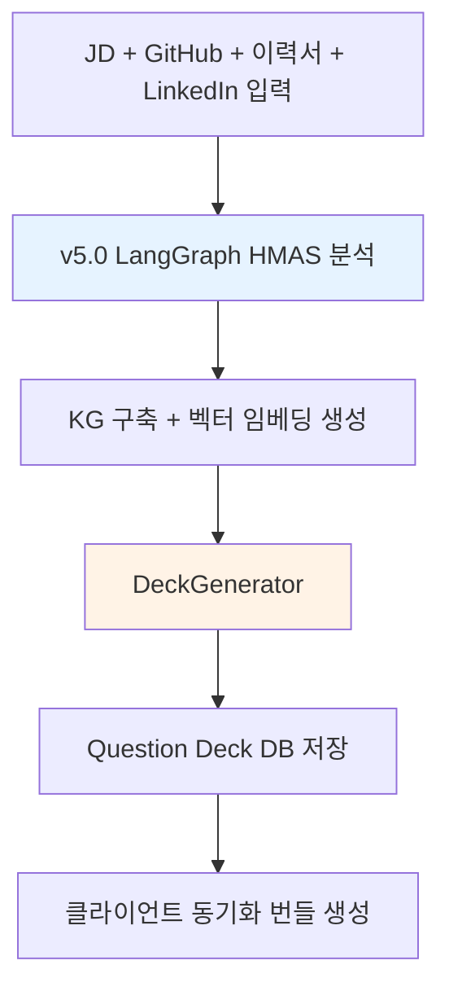

# Pre-Interview Graph (Phase 1)

> 면접 시작 전 서버에서 실행되는 LangGraph 파이프라인. v5.0 HMAS 분석(MetaAgent) 결과를 기반으로 Knowledge Graph를 구축하고, Question Deck을 생성하여 클라이언트에 동기화한다.

## 전체 흐름



## HMAS 분석 (MetaAgent)

Pre-Interview의 핵심은 [[hmas-graph/MOC|HMAS Graph]]를 통한 전체 분석이다:

1. **ForensicSupervisor**: GitHub 코드 수집 + Identity Resolution + 진정성 검증
2. **LogicSupervisor**: AST + 복잡도 + 품질 스캔
3. **StackSupervisor**: 기술 매핑 + API 깊이 + 아키텍처 평가
4. **ProfileSynthesizer**: 4대 지표 산출 + UnifiedCandidateProfile 생성

분석 결과는 Knowledge Graph 노드/엣지로 변환되어 DB에 저장된다.

## DeckGenerator 서비스

분석 완료 후 KG를 탐색하여 주제별 질문 카드를 생성한다.

```python
# domain/services/deck_generator.py
class DeckGenerator:
    """v5.0 분석 완료 후 KG 기반 Question Deck 생성"""

    async def generate(self, candidate_id: str) -> QuestionDeck:
        # 1. JD 커버리지 분석 -- 미검증 역량 목록 추출
        unverified = await self.graph_tools.get_jd_coverage(candidate_id)

        # 2. 모순점 발굴 -- 이력서 vs 코드 vs LinkedIn 교차 검증
        contradictions = await self.graph_tools.find_contradictions(candidate_id)

        # 3. 미확인 주장 -- 증거 없는 Claim 노드 식별
        unverified_claims = await self.graph_tools.get_unverified_topics(candidate_id)

        # 4. 주제별 질문 카드 생성 (Kimi K2.5, 시간 여유 -> 깊이 있게)
        deck = QuestionDeck(candidate_id=candidate_id)

        for topic in unverified.topics:
            evidence = await self.graph_tools.get_skill_evidence(topic.skill)
            cards = await self.llm.generate_questions(
                topic=topic, evidence=evidence, depth="deep"
            )
            deck.add_group(TopicGroup(
                topic=topic.name,
                jd_requirement_ref=topic.jd_ref,
                cards=cards,
                status=TopicStatus.PENDING,
            ))

        # 5. Red Flags + Ice Breakers 별도 생성
        deck.red_flags = await self._generate_red_flags(contradictions)
        deck.ice_breakers = await self._generate_ice_breakers(candidate_id)

        return deck
```

## Question Deck 도메인 모델

```python
# domain/models/question_deck.py
class QuestionCard:
    question: str           # 질문 본문
    intent: str             # 이 질문의 목적 (1줄)
    evidence_summary: str   # 근거 요약 (1줄)
    priority: Priority      # HIGH / MEDIUM / LOW
    category: str           # 연결된 JD 요구사항 or 역량

class TopicGroup:
    topic: str              # "MSA 경험", "트러블슈팅", "리더십" 등
    jd_requirement_ref: str # JD 요구사항 노드 ID
    cards: list[QuestionCard]  # 주제별 2-3개 질문
    status: TopicStatus     # PENDING / PARTIAL / VERIFIED

class QuestionDeck:
    candidate_id: str
    groups: list[TopicGroup]   # 주제별 그룹 (5-8개)
    red_flags: list[QuestionCard]  # 모순/위험 신호 (별도 분리)
    ice_breakers: list[QuestionCard]  # 오프닝 질문 (1-2개)
```

## 클라이언트 동기화

면접 시작 전 Electron 앱이 서버에서 번들을 다운로드한다.

```
GET /api/v1/sync/{candidate_id}/bundle
    |
    +-- KG JSON export -> graphology (In-memory Graph)
    +-- Embeddings -> LanceDB (In-process Vector DB)
    +-- Question Deck -> 로컬 저장소
```

**Local-First 원칙**: 동기화 완료 후 면접 중에는 서버 의존 없이 클라이언트만으로 동작한다. 네트워크 장애 시에도 Deck 카드와 로컬 RAG 검색이 정상 작동한다.

## Deck 예시

```
Question Deck -- 김민수 (Backend Engineer)

Ice Breaker:
  "GitHub에서 spring-commerce 프로젝트를 활발히 하신 것 같은데,
   최근 가장 집중하고 계신 기술이 뭔가요?"
  의도: 자연스러운 대화 시작 + 관심사 파악

주제 1: MSA 분산 환경 [미검증] -- 질문 3개
  Q1. "서비스를 어떤 기준으로 분리하셨나요?" (의도: MSA 설계 원칙)
  Q2. "서비스 간 통신은 어떤 방식을 사용하셨나요?" (의도: 실무 수준)
  Q3. "분산 트랜잭션 이슈를 겪으신 적 있나요?" (의도: 실전 경험 깊이)

Red Flags:
  이력서: "팀 프로젝트로 캐싱 구축" / Git: 커밋 1인 = 본인만
  Q. "캐싱 레이어 구축 시 팀 내 역할 분담은 어떻게 하셨나요?"
```

## 관련 문서

- [[hmas-graph/MOC]] -- Pre-Interview 분석 엔진
- [[live-session/live-engine]] -- Deck을 소비하는 실시간 엔진
- [[live-session/three-layer-questions]] -- Layer 1(Deck) + Layer 2(실시간) 비교
