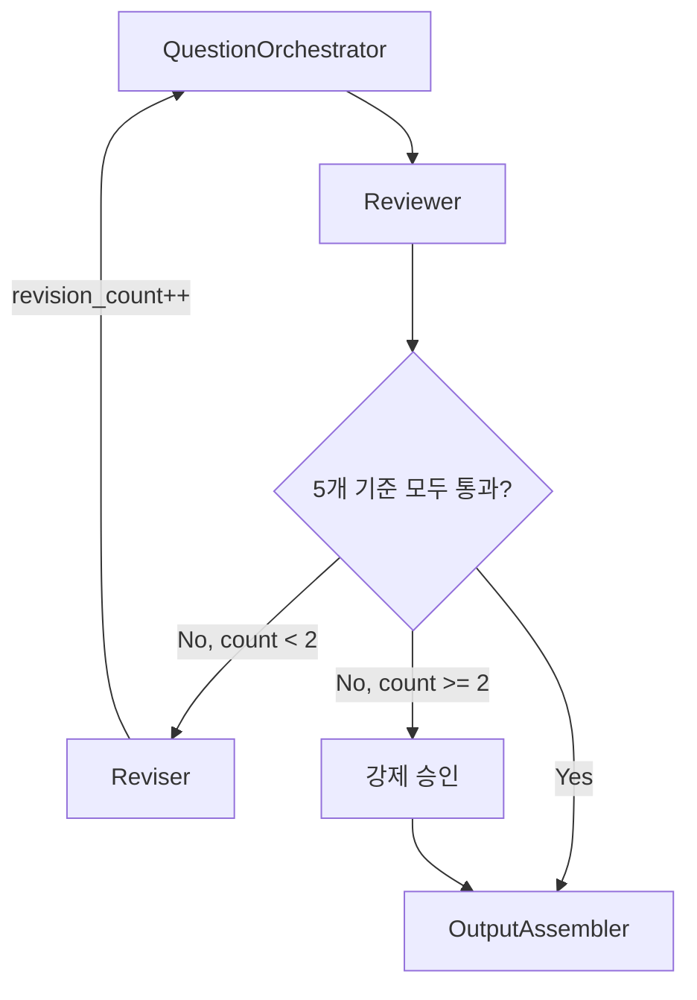

# Quality Gate

> 질문 세트의 품질을 검증하고 기준 미달 시 재생성하는 리뷰 루프. Reviewer가 5개 기준으로 검증하고, Reviser가 조건부로 QuestionOrchestrator를 재실행한다. 최대 2회 루프 후 강제 승인.

## 검증 흐름



## 적용 시점

| Phase | 적용 대상 | 루프 |
|-------|----------|------|
| Pre-Interview (Phase 4) | v5.0 질문 세트 | 최대 2회 |
| Post-Interview (Phase 3) | 스코어카드 품질 | 별도 검증 |

## 하위 문서

```dataview
TABLE title, status, type
FROM "docs/architecture/application/quality-gate"
WHERE type = "component"
SORT file.name ASC
```

## 관련 Linear 티켓

| 티켓 | 제목 |
|------|------|
| JIT-109 | QualityGate 루프 (Reviewer + Reviser, 최대 2회 루프) |

## 소스

- `plan/v5-design/phase4-questions.md` SS14.4 (Phase 4: QualityGate 루프)
