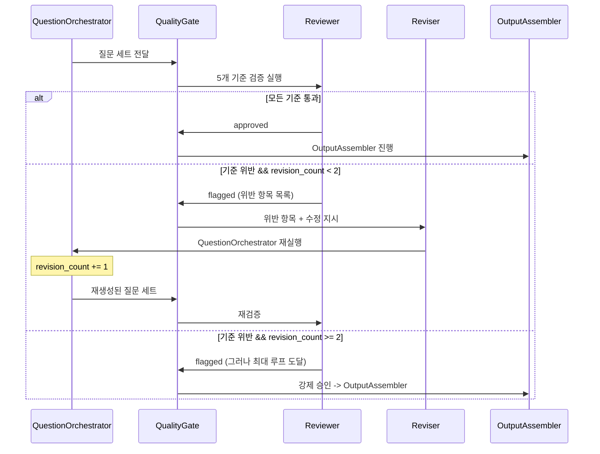

# Review Loop

> QualityGate의 Reviewer + Reviser 조건부 루프 구현. MetaAgent Graph에서 `add_conditional_edges`로 등록되며, `should_revise` 함수가 revise/approve를 결정한다.

## 검증 파이프라인



## 5개 품질 검증 기준

| # | 기준 | 검증 방법 | 위반 시 |
|---|------|----------|--------|
| 1 | **JD 관련성** | 모든 질문이 JD 요구사항 노드와 연결되어 있는지 | flag: `jd_relevance` |
| 2 | **코드 레퍼런스 정확성** | 참조된 파일:라인이 실제 코드와 일치하는지 | flag: `code_reference` |
| 3 | **비개발자 이해도** | 용어 설명(`terminology`) + 답변 가이드(`expected_answer_guide`) 포함 여부 | flag: `accessibility` |
| 4 | **3전략 균형** | Negative/Complexity/Evolution 전략별 질문 수 편중 방지 | flag: `strategy_balance` |
| 5 | **중복 질문** | 의미적 유사도 기반 중복 감지 (임베딩 cosine > threshold) | flag: `duplicate` |

## should_revise 함수

```python
# application/nodes/quality_gate.py
def should_revise(state: MetaState) -> str:
    """QualityGate의 conditional edge 판별 함수"""
    if state["revision_count"] < 2 and has_flagged_issues(state):
        return "revise"
    return "approve"

def has_flagged_issues(state: MetaState) -> bool:
    """5개 기준 중 하나라도 위반 시 True"""
    quality_result = state.get("quality_result", {})
    flags = quality_result.get("flags", [])
    return len(flags) > 0
```

### MetaAgent Graph 등록

```python
builder.add_conditional_edges(
    "quality_gate",
    should_revise,
    {"revise": "question_orchestrator", "approve": "output_assembler"},
)
```

## Reviewer 구현

```python
# application/nodes/quality_gate.py
async def quality_gate_node(state: MetaState) -> dict:
    """5개 기준으로 질문 세트를 검증"""
    questions = await question_repository.get_by_job(state["job_id"])
    jd_data = await job_repository.get_jd(state["job_id"])

    flags = []

    # 1. JD 관련성 검증
    for q in questions:
        if not q.code_reference or not matches_jd(q, jd_data):
            flags.append({"type": "jd_relevance", "question_id": q.question_id})

    # 2. 코드 레퍼런스 정확성
    for q in questions:
        if q.code_reference and not await verify_code_ref(q.code_reference):
            flags.append({"type": "code_reference", "question_id": q.question_id})

    # 3. 비개발자 이해도
    for q in questions:
        if not q.terminology or not q.expected_answer_guide:
            flags.append({"type": "accessibility", "question_id": q.question_id})

    # 4. 3전략 균형
    strategy_counts = Counter(q.strategy for q in questions)
    if max(strategy_counts.values()) > 2 * min(strategy_counts.values()):
        flags.append({"type": "strategy_balance"})

    # 5. 중복 질문
    duplicates = await detect_duplicates(questions)
    flags.extend({"type": "duplicate", "pair": d} for d in duplicates)

    return {
        "quality_result": {"flags": flags, "passed": len(flags) == 0},
        "revision_count": state["revision_count"] + (1 if flags else 0),
    }
```

## revision_count 흐름

```
초기: revision_count = 0

1차 검증:
  -> flag 발견: revise -> revision_count = 1
  -> QuestionOrchestrator 재실행 (flagged 질문만 재생성)

2차 검증:
  -> flag 발견: revise -> revision_count = 2
  -> QuestionOrchestrator 2차 재실행

3차 검증:
  -> revision_count >= 2: 강제 approve (루프 종료)
  -> OutputAssembler로 진행 (최선의 결과물 사용)
```

## InterviewQuestion 모델 (검증 대상)

```python
# domain/question/models.py
class InterviewQuestion(BaseModel):
    question_id: str
    category: str      # technical_depth | execution_ownership | communication | role_fit | risk_flags
    strategy: str      # negative_selection | intentional_complexity | evolution
    difficulty: str    # easy | medium | hard
    question_text: str = Field(min_length=20, max_length=500)
    intent: str = Field(description="이 질문의 의도 (비개발자용)")
    code_reference: str | None = Field(description="관련 코드 파일:라인")
    expected_answer_guide: str = Field(description="비개발자도 이해 가능한 예상 답변 가이드")
    red_flags: list[str] = Field(description="주의해야 할 답변 패턴")
    follow_up_triggers: list[str] = Field(description="파생 질문 트리거 조건")
    terminology: list[dict] = Field(description="질문에 포함된 전문 용어 설명")
```

## 3전략 참조

QualityGate가 검증하는 3전략은 [[domain/question-generation/MOC|질문 생성 도메인]]에서 정의된다:

| 전략 | 핵심 원리 | 질문 예시 |
|------|----------|----------|
| **Negative Selection** | 사용하지 않은 기술을 질문하여 의도적 선택인지 판별 | "async/await를 적용하지 않고 동기식으로 처리하셨습니다" |
| **Intentional Complexity** | 복잡도가 높은 구간의 의도를 질문 | "validateToken의 순환 복잡도가 매우 높습니다" |
| **Code Evolution** | 코드 변화 과정을 질문하여 실제 작성자인지 판별 | "PaymentGateway가 3번 구조 변경되었습니다" |

## 관련 문서

- [[hmas-graph/conditional-edges]] -- should_revise conditional edge 등록
- [[hmas-graph/meta-agent]] -- QualityGate를 포함하는 MetaAgent Graph
- [[domain/question-generation/MOC]] -- 3전략 질문 생성 도메인
- [[state-management/meta-state]] -- revision_count 등 Flow Control 필드
