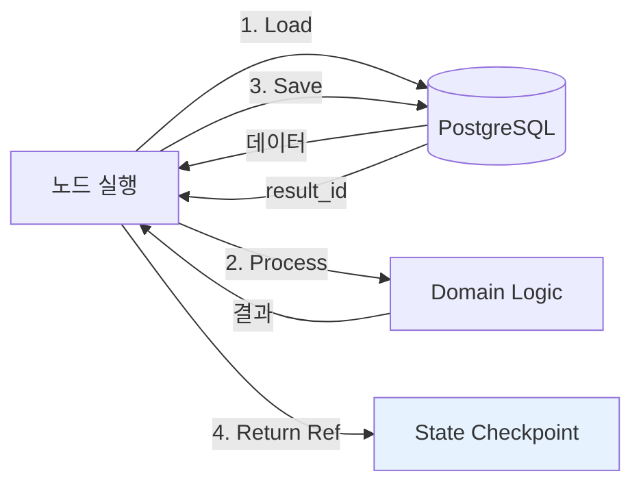

# State Management

> LangGraph StateGraph의 상태 관리 전략. Reference Passing 패턴으로 State 크기를 상수 수준으로 유지하고, PostgreSQL Checkpointer로 장애 복구를 보장한다.

## 핵심 원칙



| 원칙 | 설명 |
|------|------|
| **State에 Raw Data 금지** | AST, Diff, Blame 등 대용량 데이터는 DB에 저장, State에는 UUID만 |
| **Load -> Process -> Save -> Ref** | 모든 노드의 표준 4단계 패턴 |
| **Checkpoint 크기 상수화** | MetaState는 최대 수 KB (UUID 10여개 + 가벼운 메트릭) |
| **장애 복구** | Checkpoint에는 ID만 -> 재시작 시 DB에서 결과 다시 로딩 |

## 하위 문서

```dataview
TABLE title, status, type
FROM "docs/architecture/application/state-management"
WHERE type = "component"
SORT file.name ASC
```

## 관련 ADR

- [[decisions/0004-reference-passing]] -- Reference Passing 결정 배경
- [[decisions/0001-langgraph-over-temporal]] -- LangGraph State 구조 원인
- [[decisions/0003-ddd-four-layers]] -- Load/Save 계층 위치

## 관련 Linear 티켓

| 티켓 | 제목 |
|------|------|
| JIT-100 | State 정의 (MetaState, ForensicState, LogicState, StackState) |
| JIT-84 | init.sql (analysis_results 테이블 포함) |
