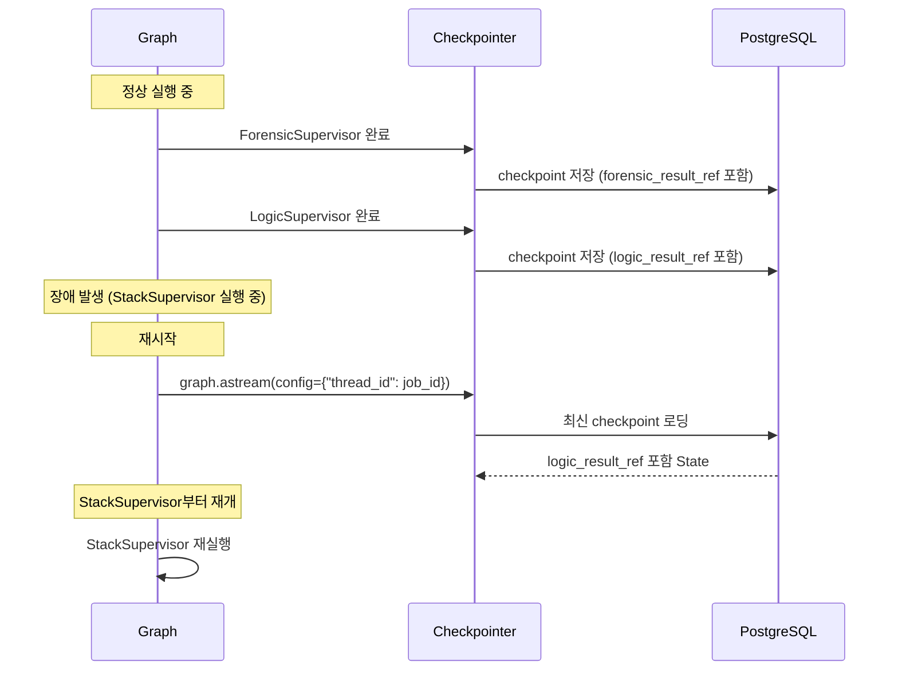

# Checkpoint Schema

> LangGraph 3.0.x의 `langgraph-checkpoint-postgres` 패키지가 사용하는 PostgreSQL 테이블 구조. AsyncPostgresSaver가 각 노드 실행 후 State를 직렬화하여 저장하며, 장애 시 마지막 Checkpoint부터 재개한다.

## Checkpointer 초기화

```python
# interface/api/routes/jobs.py
from langgraph.checkpoint.postgres.aio import AsyncPostgresSaver

async def run_analysis(job_id: str, input_data: dict):
    async with AsyncPostgresSaver.from_conn_string(DB_URI) as checkpointer:
        graph = build_meta_graph().compile(checkpointer=checkpointer)
        config = {"configurable": {"thread_id": job_id}}

        async for event in graph.astream(input_data, config, stream_mode="updates"):
            await ws_manager.broadcast(job_id, event)
```

`thread_id`로 `job_id`를 사용하여 분석 작업별로 독립적인 Checkpoint 스레드를 생성한다.

## LangGraph 3.0.x Checkpoint 테이블

`langgraph-checkpoint-postgres` 3.0.4+가 자동 생성하는 테이블 구조:

### checkpoints 테이블

```sql
CREATE TABLE IF NOT EXISTS checkpoints (
    thread_id TEXT NOT NULL,
    checkpoint_ns TEXT NOT NULL DEFAULT '',
    checkpoint_id TEXT NOT NULL,
    parent_checkpoint_id TEXT,
    type TEXT,
    checkpoint JSONB NOT NULL,
    metadata JSONB NOT NULL DEFAULT '{}',
    PRIMARY KEY (thread_id, checkpoint_ns, checkpoint_id)
);
```

| 컬럼 | 타입 | 설명 |
|------|------|------|
| `thread_id` | TEXT | 분석 작업 ID (`job_id`) |
| `checkpoint_ns` | TEXT | Namespace (Subgraph 구분) |
| `checkpoint_id` | TEXT | 체크포인트 고유 ID (시간 순서) |
| `parent_checkpoint_id` | TEXT | 이전 체크포인트 (연결 리스트) |
| `type` | TEXT | 직렬화 방식 |
| `checkpoint` | JSONB | **State 직렬화 데이터** |
| `metadata` | JSONB | 노드 이름, 실행 시간 등 메타데이터 |

### checkpoint_writes 테이블

```sql
CREATE TABLE IF NOT EXISTS checkpoint_writes (
    thread_id TEXT NOT NULL,
    checkpoint_ns TEXT NOT NULL DEFAULT '',
    checkpoint_id TEXT NOT NULL,
    task_id TEXT NOT NULL,
    idx INTEGER NOT NULL,
    channel TEXT NOT NULL,
    type TEXT,
    value JSONB,
    PRIMARY KEY (thread_id, checkpoint_ns, checkpoint_id, task_id, idx)
);
```

| 컬럼 | 타입 | 설명 |
|------|------|------|
| `task_id` | TEXT | 개별 노드 실행 ID |
| `channel` | TEXT | State 채널 (필드명) |
| `value` | JSONB | 해당 채널의 업데이트 값 |

## Reference Passing과의 관계

[[state-management/reference-passing|Reference Passing]] 덕분에 `checkpoint` JSONB에는 UUID 문자열만 저장된다.

### Checkpoint 데이터 예시

```json
{
  "job_id": "550e8400-e29b-41d4-a716-446655440000",
  "input_data_ref": "660e8400-e29b-41d4-a716-446655440001",
  "identity_cluster_ref": "770e8400-e29b-41d4-a716-446655440002",
  "forensic_result_ref": "880e8400-e29b-41d4-a716-446655440003",
  "logic_result_ref": "990e8400-e29b-41d4-a716-446655440004",
  "stack_result_ref": null,
  "candidate_scores": null,
  "status": "logic_complete",
  "revision_count": 0,
  "errors": []
}
```

**Checkpoint 크기**: ~500 바이트 (UUID x 5 + 메타데이터). Raw Data State였다면 수십 MB.

## 장애 복구 시나리오



**핵심**: Checkpoint에는 ID만 있고, 실제 분석 결과는 `analysis_results` 테이블에 영구 저장되어 있으므로, 장애 후 재시작 시 이미 완료된 Supervisor의 결과를 DB에서 다시 로딩할 수 있다.

## 관련 테이블 구조

Checkpoint 외에 실제 분석 데이터가 저장되는 테이블:

```sql
-- 분석 결과 저장소 (Worker별 결과)
CREATE TABLE analysis_results (
    id UUID PRIMARY KEY DEFAULT uuid_generate_v4(),
    job_id UUID REFERENCES jobs(id) ON DELETE CASCADE,
    worker_name VARCHAR(50) NOT NULL,
    supervisor_name VARCHAR(30) NOT NULL,
    result_data JSONB NOT NULL,
    metrics JSONB,
    created_at TIMESTAMPTZ DEFAULT NOW()
);

-- Identity Resolution 결과
CREATE TABLE identity_resolutions (
    id UUID PRIMARY KEY DEFAULT uuid_generate_v4(),
    job_id UUID REFERENCES jobs(id) ON DELETE CASCADE,
    cluster_data JSONB NOT NULL,
    created_at TIMESTAMPTZ DEFAULT NOW()
);
```

## 운영 고려사항

| 항목 | 설정 |
|------|------|
| Checkpoint 보존 기간 | 분석 완료 후 7일 (이후 정리) |
| 동시 thread 수 | 분석 작업당 1개 thread |
| 디스크 사용량 | thread당 ~50 KB (Reference Passing) |
| 복구 시간 | < 1초 (Checkpoint 로딩 + State 복원) |

## 관련 문서

- [[state-management/reference-passing]] -- Checkpoint 크기를 줄이는 핵심 패턴
- [[state-management/meta-state]] -- Checkpoint에 저장되는 MetaState 구조
- [[hmas-graph/meta-agent]] -- Checkpointer를 사용하는 MetaAgent Graph
