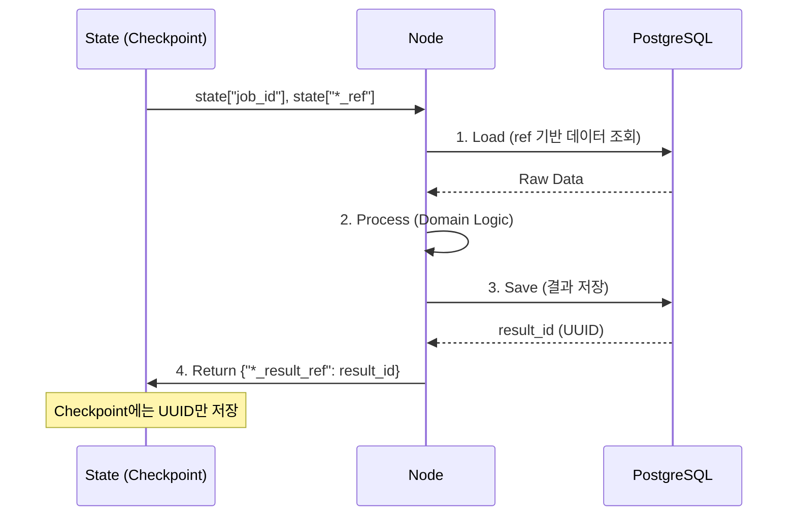

# Reference Passing Pattern

> State 객체에 Raw Data를 직접 넣으면 DB Checkpoint 크기가 폭발하고 성능이 저하된다. **DB Primary Key(UUID)만 전달**하는 Reference Passing 패턴을 적용한다. 상세 결정 배경은 [[decisions/0004-reference-passing|ADR-0004]]를 참조한다.

## 문제: Raw Data State

```python
# AS-IS: State에 Raw Data 직접 포함 (문제 있는 방식)
class MetaState(TypedDict):
    raw_ast_data: dict          # 수십 MB 가능
    full_blame_output: str      # 수 MB
    full_diff_content: list     # 수 MB
```

| 문제 | 영향 |
|------|------|
| Checkpoint 크기 폭발 | 각 노드 실행마다 수십 MB가 DB에 직렬화 |
| 메모리 힙 증가 | Python 프로세스 메모리가 레포 크기에 비례 |
| 직렬화 오버헤드 | 대용량 dict/str의 BYTEA 직렬화/역직렬화 비용 |
| 체크포인트 복구 지연 | 장애 후 재시작 시 대용량 State 로딩 시간 |

## 해결: Reference Passing

```python
# TO-BE: State에는 DB ID만 저장
class MetaState(TypedDict):
    job_id: str
    input_data_ref: str                   # jobs 테이블 ID
    identity_cluster_ref: Optional[str]   # identity_resolutions 테이블 ID
    forensic_result_ref: Optional[str]    # analysis_results 테이블 ID
    logic_result_ref: Optional[str]       # analysis_results 테이블 ID
    stack_result_ref: Optional[str]       # analysis_results 테이블 ID
    candidate_scores: Optional[dict]      # 수 KB 이하 (inline 허용)
    status: str
    revision_count: int
    errors: list[str]
```

## 노드 구현 표준 패턴: Load -> Process -> Save -> Return Ref

모든 LangGraph 노드는 다음 4단계를 따른다.

```python
# application/nodes/logic_supervisor.py
async def logic_supervisor_node(state: MetaState) -> dict:
    job_id = state["job_id"]

    # 1. Load: DB에서 필요한 데이터 조회 (ref 기반)
    repo_files = await repo_repository.get_files(job_id)

    # 2. Process: 분석 수행 (domain + infrastructure 호출)
    ast_result = await ast_analyzer.analyze(repo_files)

    # 3. Save: 대용량 결과를 DB에 저장
    result_id = await analysis_repository.save_result(
        job_id, "logic_supervisor", ast_result
    )

    # 4. Return Ref: ID만 리턴 (State Checkpoint에는 ID만 기록)
    return {"logic_result_ref": result_id}
```

### 4단계 흐름도



## DB 저장소: analysis_results 테이블

```sql
-- init.sql 발췌
CREATE TABLE analysis_results (
    id UUID PRIMARY KEY DEFAULT uuid_generate_v4(),
    job_id UUID REFERENCES jobs(id) ON DELETE CASCADE,
    worker_name VARCHAR(50) NOT NULL,
    supervisor_name VARCHAR(30) NOT NULL,
    result_data JSONB NOT NULL,   -- 실제 분석 데이터 저장 위치
    metrics JSONB,
    created_at TIMESTAMPTZ DEFAULT NOW()
);
```

## Inline 허용 기준

State에 직접 포함 가능한 데이터의 기준:

| 기준 | 허용 | 불허 |
|------|------|------|
| 크기 | 수 KB 이하 | 수십 KB 이상 |
| 변동성 | 분석 대상 크기와 무관 | 레포 크기에 비례 |
| 예시 | `candidate_scores`, `status`, `revision_count` | AST, Diff, Blame |

## 성능 효과

| 지표 | Raw Data State | Reference Passing |
|------|---------------|-------------------|
| Checkpoint 크기 | 수십 MB (가변) | 수 KB (상수) |
| 직렬화 시간 | 레포 크기 비례 | 일정 (~ms) |
| 메모리 사용 | 레포 크기 비례 | 상수 수준 |
| 장애 복구 시간 | 대용량 로딩 | 즉시 (ID만 복원) |
| 결과 재사용 | State 내부에 묶임 | DB에서 독립 조회 가능 |

## 관련 문서

- [[decisions/0004-reference-passing]] -- ADR 결정 배경 및 근거
- [[state-management/meta-state]] -- MetaState 전체 필드 정의
- [[state-management/checkpoint-schema]] -- PostgreSQL Checkpoint 테이블
- [[hmas-graph/meta-agent]] -- Reference Passing을 사용하는 MetaAgent Graph
