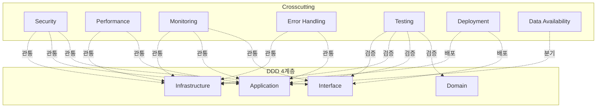

# Crosscutting Concerns

> 모든 계층을 관통하는 횡단 관심사.
> 보안, 성능, 모니터링, 에러 처리, 테스트, 배포, 데이터 가용성 전략.

## 문서 목록

| 문서 | 내용 |
|------|------|
| [[crosscutting/security\|Security]] | 인증/인가, OAuth, API 보안 |
| [[crosscutting/performance\|Performance]] | 병렬화, 캐싱, Reference Passing |
| [[crosscutting/monitoring\|Monitoring]] | Langfuse 트레이싱, 로깅 |
| [[crosscutting/error-handling\|Error Handling]] | Graceful Degradation, 재시도 |
| [[crosscutting/testing-strategy\|Testing Strategy]] | 테스트 계층, 시나리오, 커버리지 |
| [[crosscutting/deployment\|Deployment]] | Docker Compose + Cloudflare Tunnel |
| [[crosscutting/data-availability-tiers\|Data Availability Tiers]] | Platinum/Gold/Silver 데이터 가용성 |

## 계층 관계



## 문서 목록 (자동)

```dataview
TABLE status, updated, tags
FROM "docs/architecture/crosscutting"
WHERE file.name != "MOC"
SORT file.name ASC
```
