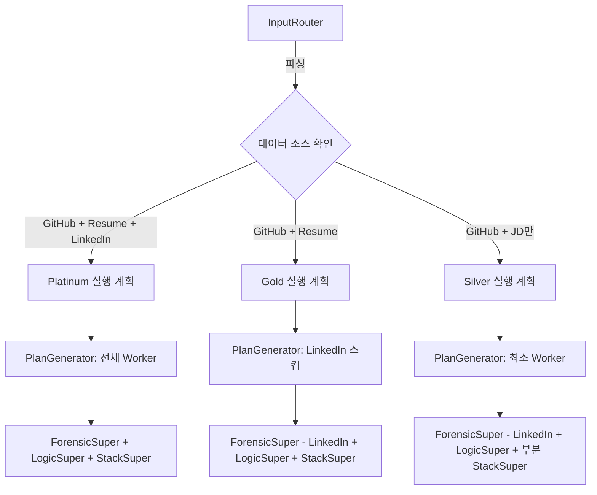

# Data Availability Tiers

> 입력 데이터 조합에 따라 분석 파이프라인의 실행 범위와 신뢰도가 달라진다.
> Platinum(최대) / Gold(중간) / Silver(최소) 3단계 티어로 분류.

## 3단계 티어 정의

| 티어 | 데이터 소스 | 신뢰도 | 실행 Worker |
|------|-----------|:---:|-----------|
| **Platinum** | 이력서 + GitHub + LinkedIn (+ 포트폴리오/커버레터) | `high` (Green) | 전체 W1-W11 |
| **Gold** | 이력서 + GitHub (LinkedIn 없음) | `medium` (Yellow) | W1-W11 (LinkedIn 관련 스킵) |
| **Silver** | GitHub + JD만 (이력서/LinkedIn 없음) | `low` (Red) | W1-W8 + 부분 W9-W11 |

## 신뢰도 산출 조건

| 신뢰도 | 조건 | 표시 |
|--------|------|------|
| `high` (Green) | 데이터 소스 3개 이상 + 공개 레포 5개 이상 | 초록색 |
| `medium` (Yellow) | 데이터 소스 2개 + 공개 레포 2-4개 | 노란색 |
| `low` (Red) | 데이터 소스 1개 또는 공개 레포 1개 이하 | 빨간색 |

## InputRouter 분기 로직

InputRouter(Phase 0)에서 입력 데이터를 파싱하고, 가용한 소스에 따라 실행 계획을 조정:



## 티어별 Worker 실행 매트릭스

| Worker | Platinum | Gold | Silver | 비고 |
|--------|:---:|:---:|:---:|------|
| W1: Collector | O | O | O | GitHub GraphQL |
| W2: Cleaner | O | O | O | Funnel Selection |
| W3: Vibector | O | O | O | AI 코드 탐지 |
| W4: CLAVE | O | O | O | 스타일로메트리 |
| W5: Datasketch | O | O | O | 표절 탐지 |
| W6: ASTAnalyzer | O | O | O | Tree-sitter |
| W7: ComplexityMeter | O | O | O | Radon/Lizard |
| W8: QualityScanner | O | O | O | SonarQube |
| W9: SkillExtractor | O | O | **Partial** | 이력서 없으면 코드만 |
| W10: APIDepth | O | O | O | 코드 기반 |
| W11: Architecture | O | O | **Partial** | LinkedIn 경력 없으면 코드만 |
| LinkedIn 프로필 분석 | O | **Skip** | **Skip** | LinkedIn 없으면 스킵 |

## Conditional Edges 구현

PlanGenerator에서 동적으로 실행 계획을 생성:

```python
# application/nodes/plan_generator.py
async def plan_generator_node(state: MetaState) -> dict:
    input_data = await job_repository.get_input(state["job_id"])

    # 데이터 소스 가용성 판정
    has_github = bool(input_data.get("github_urls"))
    has_resume = bool(input_data.get("resume_text"))
    has_linkedin = bool(input_data.get("linkedin_url"))

    # 티어 결정
    source_count = sum([has_github, has_resume, has_linkedin])
    repo_count = len(input_data.get("github_urls", []))

    if source_count >= 3 and repo_count >= 5:
        tier = "platinum"
        confidence = "high"
    elif source_count >= 2 and repo_count >= 2:
        tier = "gold"
        confidence = "medium"
    else:
        tier = "silver"
        confidence = "low"

    # 실행 계획 생성
    plan = {
        "tier": tier,
        "confidence": confidence,
        "skip_linkedin": not has_linkedin,
        "skip_resume_enrichment": not has_resume,
        "workers": build_worker_list(tier, has_linkedin, has_resume),
    }

    return {"execution_plan": plan, "status": "planned"}
```

## Fallback 전략

각 티어에서 데이터가 부족할 때의 대체 전략:

### LinkedIn 없음 (Gold/Silver)

```
정상 흐름:
  CollectorWorker → LinkedIn 스크레이핑 → 경력/스킬 추출

Fallback (LinkedIn 없음):
  CollectorWorker → LinkedIn 스킵
  SkillExtractorWorker → 코드 분석만으로 스킬 추출 (정확도 저하)
  ArchitectureEvaluator → 경력 컨텍스트 없이 코드 구조만 평가
```

### 이력서 없음 (Silver)

```
정상 흐름:
  ProfileSynthesizer → 이력서 + 코드 + LinkedIn 교차 검증

Fallback (이력서 없음):
  ProfileSynthesizer → 코드 분석만으로 프로필 생성
  QuestionOrchestrator → Negative Selection 전략 제한 (이력서 모순 검증 불가)
  OutputAssembler → "이력서 미제공" 경고 표시
```

### 최소 데이터 (Silver)

```
Silver 티어에서의 제한사항:
1. 3전략 중 Negative Selection 제한 (교차 검증 데이터 부족)
2. 4대 지표 중 진정성 점수 신뢰도 낮음 (비교 대상 부족)
3. 면접 질문: 코드 기반 질문 위주 (경력/프로젝트 질문 제한)
4. CEO 3초 요약: 신뢰도 "낮음" 표시 + 추가 데이터 요청 안내
```

## 프론트엔드 표시

Overview 탭에서 데이터 가용성을 명시적으로 표시:

```
┌──────────────────────────────────────────────┐
│  종합 등급: B+ (상위 15%)                     │
│  데이터 신뢰도: ⚠️ Medium (Gold Tier)          │
│  ──────────────────────────────────────       │
│  제공 데이터: GitHub (3 repos) + 이력서        │
│  미제공: LinkedIn                              │
│  ──────────────────────────────────────       │
│  💡 LinkedIn 프로필을 추가하면 더 정확한        │
│     분석이 가능합니다.                          │
└──────────────────────────────────────────────┘
```

## 테스트 시나리오 매핑

| 테스트 | 티어 | 파일 |
|--------|------|------|
| Scenario 1: Happy Path | Platinum | `test_happy_path.py` |
| Scenario 2: Partial Data | Silver | `test_partial_data.py` |
| Scenario 4: Worker Failure | Gold + W8 실패 | `test_worker_failure.py` |

## 관련 문서

- [[domain/scoring-system/confidence-levels]] -- 신뢰도 산출 상세
- [[application/hmas-graph/MOC]] -- HMAS Graph 실행 흐름
- [[crosscutting/error-handling]] -- Worker 실패 시 Graceful Degradation
- [[crosscutting/testing-strategy]] -- E2E 테스트 시나리오
