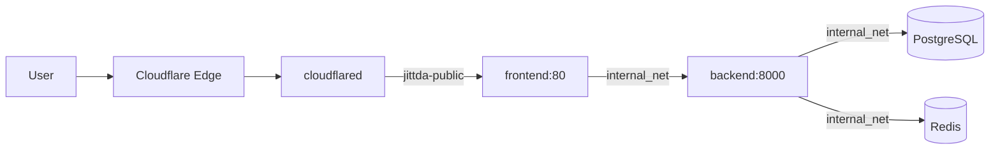

# Deployment

> Docker Compose + Cloudflare Tunnel 기반 배포 아키텍처.
> 인프라(Tunnel)와 애플리케이션(Jittda)의 생명주기 분리.

## 인프라 분리 원칙

```
/ (Root)
├── infra-tunnel/             # [인프라] Cloudflare Tunnel 전용 (독립 생명주기)
│   ├── docker-compose.yml    # cloudflared + jittda-public 네트워크 생성
│   └── .env                  # TUNNEL_TOKEN
│
└── jittda/                   # [애플리케이션] Jittda 서비스
    ├── docker-compose.yml    # 전체 서비스 오케스트레이션
    ├── backend/Dockerfile
    ├── frontend/Dockerfile
    └── infra/postgres/init.sql
```

**분리 이유:**
- 앱을 재시작/재배포해도 **터널 연결은 유지**
- 여러 프로젝트가 하나의 터널 네트워크를 **공유 가능**
- 인프라와 애플리케이션의 **생명주기 독립**

## 트래픽 흐름



## Docker Compose 서비스 목록

### jittda/docker-compose.yml

| 서비스 | 이미지 | 포트 | 네트워크 | 비고 |
|--------|--------|------|---------|------|
| `postgres` | postgres:16-alpine | 5432 | internal_net | pgvector 확장 |
| `redis` | redis:7-alpine | 6379 | internal_net | LLM 캐시 |
| `backend` | ./backend/Dockerfile | 8000 | internal_net | FastAPI + LangGraph |
| `frontend` | ./frontend/Dockerfile | 3000 | internal_net + external_tunnel_net | React 19 + Vite |
| `frontend-public` | ./apps/public/Dockerfile | 3001 | internal_net + external_tunnel_net | 지원자용 Public App (pnpm workspace) |
| `frontend-admin` | ./apps/admin/Dockerfile | 3002 | internal_net | 관리자용 Admin App (pnpm workspace) |
| `sonarqube` | sonarqube:community | 9000 | internal_net | Profile: analysis (On-Demand) |
| `sonar-scanner` | sonar-scanner-cli | - | internal_net | Profile: analysis |

### infra-tunnel/docker-compose.yml

| 서비스 | 이미지 | 네트워크 |
|--------|--------|---------|
| `cloudflared` | cloudflare/cloudflared:latest | public_net (jittda-public) |

## 네트워크 구조

```
internal_net (bridge)
├── postgres
├── redis
├── backend
├── frontend
├── sonarqube (on-demand)
└── sonar-scanner (on-demand)

external_tunnel_net = jittda-public (external)
├── cloudflared (infra-tunnel에서 생성)
└── frontend (jittda에서 참조)
```

## Backend Dockerfile

```dockerfile
FROM python:3.11-slim

RUN apt-get update && apt-get install -y \
    git curl \
    && rm -rf /var/lib/apt/lists/*

WORKDIR /app
COPY pyproject.toml .
RUN pip install --no-cache-dir .
COPY . .

ENV PYTHONPATH=/app/src
CMD ["uvicorn", "src.interface.api.main:app", "--host", "0.0.0.0", "--port", "8000", "--reload"]
```

## Frontend Dockerfile (Multi-stage)

```dockerfile
# Stage 1: Base
FROM node:20-alpine AS base
WORKDIR /app
COPY package.json package-lock.json ./
RUN npm ci

# Stage 2: Development
FROM base AS development
COPY . .
CMD ["npm", "run", "dev", "--", "--host"]

# Stage 3: Production Build
FROM base AS builder
COPY . .
RUN npm run build

# Stage 4: Production Serve
FROM nginx:alpine AS production
COPY --from=builder /app/dist /usr/share/nginx/html
EXPOSE 80
CMD ["nginx", "-g", "daemon off;"]
```

## init.sql 핵심 테이블

| 테이블 | 용도 |
|--------|------|
| `checkpoints` | LangGraph 3.0.x Checkpoint |
| `users` | 사용자 (OAuth) |
| `jobs` | 분석 Job (status, progress, result_data) |
| `analysis_results` | Worker별 분석 결과 (Reference Passing) |
| `candidate_scores` | 4대 지표 점수 |
| `identity_resolutions` | Identity Resolution 결과 |
| `sonarqube_projects` | SonarQube 매핑 |
| `embeddings` | pgvector 벡터 임베딩 |

## Makefile 표준 명령

| 명령 | 동작 |
|------|------|
| `make tunnel-up` | Cloudflare Tunnel 시작 |
| `make up` | 앱 서비스 시작 |
| `make down` | 앱 서비스 중지 |
| `make logs` | Backend 로그 |
| `make test` | 전체 테스트 |
| `make sonar-scan` | SonarQube 분석 (On-Demand) |
| `make clean` | 볼륨 포함 삭제 |

## Cloudflare Zero Trust 설정

| 설정 | 값 |
|------|-----|
| Service | HTTP |
| URL | `jittda_frontend:80` |
| Access Policy | 허용된 이메일/도메인만 |

## 관련 문서

- [[crosscutting/security]] -- Cloudflare Zero Trust 보안
- [[crosscutting/monitoring]] -- 서비스 상태 모니터링
