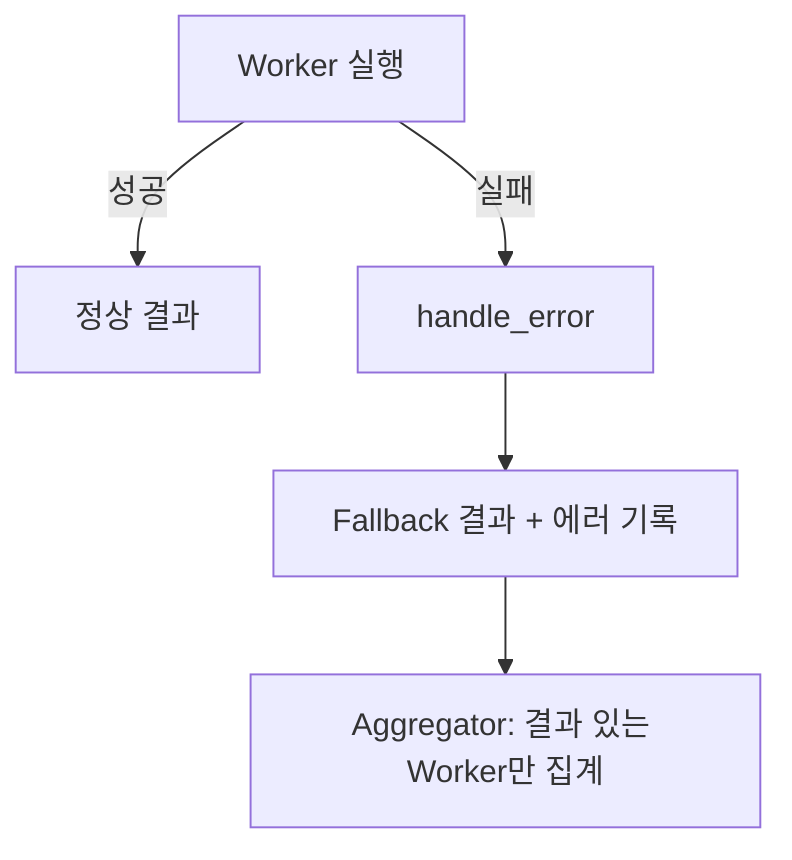

# Error Handling

> Worker 실패 시 Graceful Degradation, LLM 호출 재시도, 에러 전파 규칙.
> "하나의 Worker 실패가 전체 파이프라인을 중단시키지 않는다."

## Graceful Degradation 원칙



## BaseWorker 에러 처리 패턴

모든 Worker는 `BaseWorker` 추상 클래스의 Template Method를 따른다:

```python
# application/workers/base.py
from abc import ABC, abstractmethod

class BaseWorker(ABC):
    @abstractmethod
    def validate_input(self, input_data) -> bool:
        """입력 데이터 검증"""
        ...

    @abstractmethod
    async def execute(self, input_data):
        """핵심 분석 로직"""
        ...

    @abstractmethod
    def handle_error(self, error: Exception, input_data):
        """에러 시 Graceful Degradation"""
        ...

    async def run(self, state: dict) -> dict:
        """LangGraph 노드로 실행 (Template Method)"""
        input_data = self.parse_input(state)

        if not self.validate_input(input_data):
            return self.empty_result()

        try:
            result = await self.execute(input_data)
            return self.format_output(result)
        except Exception as e:
            return self.format_output(self.handle_error(e, input_data))
```

## Worker별 Fallback 전략

| Worker | 실패 원인 | Fallback | 영향 |
|--------|---------|----------|------|
| QualityScannerWorker (W8) | SonarQube 다운 | 인지적 복잡도 항목 null, W6+W7만 집계 | 논리력 지표 부분 결손 |
| VibectorWorker (W3) | WPM 분석 실패 | AI 코드 의심 비율 0%, 경고 표시 | 진정성 지표 낮은 신뢰도 |
| DatasketchWorker (W5) | MinHash 실패 | 표절률 0%, 미확인 표시 | 진정성 지표 낮은 신뢰도 |
| SkillExtractorWorker (W9) | AST 결과 없음 | 빈 스킬 목록 | 전문성 지표 낮은 신뢰도 |
| CollectorWorker (W1) | GitHub API 한도 | 캐시된 데이터 사용 | 분석 범위 축소 |

## LLM 호출 재시도

Instructor의 자동 재시도 메커니즘 활용:

```python
# infrastructure/llm/instructor_client.py
import instructor

client = instructor.from_openai(
    openai_client,
    max_retries=3,  # Pydantic ValidationError 시 자동 재시도
)
```

| 재시도 대상 | 최대 횟수 | 백오프 |
|-----------|---------|--------|
| Pydantic ValidationError | 3회 | Instructor 내장 |
| API Rate Limit (429) | 5회 | Exponential (1s, 2s, 4s, 8s, 16s) |
| Timeout | 2회 | 10초 간격 |
| 서버 에러 (500) | 3회 | Exponential |

## QualityGate 루프 제어

질문 품질 미달 시 재생성 루프 -- 최대 2회로 제한:

```python
def should_revise(state: MetaState) -> str:
    """QualityGate 조건부 분기."""
    if state["revision_count"] >= 2:
        return "approve"  # 최대 루프 초과 -> 강제 통과
    if has_quality_issues(state):
        return "revise"   # 재생성 요청
    return "approve"      # 품질 충족
```

## 에러 전파 규칙

```
Worker 에러 → Supervisor Aggregator: 에러 Worker 스킵, 나머지 집계
Supervisor 에러 → MetaAgent: MetaState.errors에 기록, 계속 진행
전체 실패 → MetaAgent: status='failed', error_message 저장
```

| 에러 심각도 | 처리 | WebSocket 메시지 |
|-----------|------|-----------------|
| Worker 부분 실패 | Graceful Degradation | `{ type: "error", is_fatal: false }` |
| Supervisor 실패 | 해당 지표 null | `{ type: "error", is_fatal: false }` |
| 전체 파이프라인 실패 | Job status='failed' | `{ type: "error", is_fatal: true }` |

## 관련 문서

- [[application/hmas-graph/MOC]] -- HMAS 그래프 에러 처리
- [[crosscutting/monitoring]] -- 에러 로깅/추적
- [[interface/websocket/realtime-protocol]] -- 에러 메시지 타입
