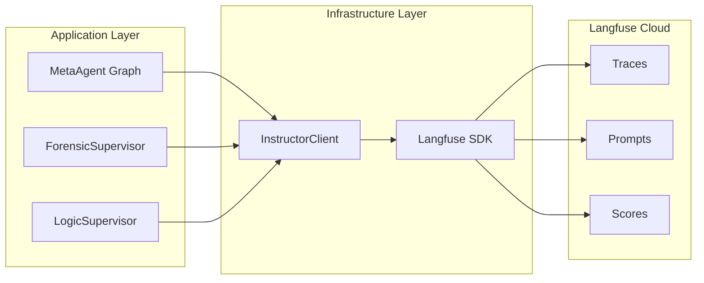

# Monitoring

> Langfuse 트레이싱, 구조화 로깅, 메트릭 수집.
> LLM 호출 비용 추적, 파이프라인 실행 시간 모니터링.

## Langfuse 트레이싱 아키텍처



## Langfuse-First 아키텍처

프롬프트 관리는 **Langfuse가 런타임 우선**:

```
YAML 프롬프트 파일 (소스)
    ↓ upload_prompts_to_langfuse.py
Langfuse 프롬프트 레지스트리 (런타임)
    ↓ SDK fetch
InstructorClient (사용)
```

- YAML 수정만으로는 반영 안 됨 -- 반드시 Langfuse 업로드 필요
- 프롬프트 버전 관리, A/B 테스트 지원
- 프롬프트별 성능 메트릭 추적

## 트레이싱 계층

| 레벨 | 범위 | Langfuse 개념 |
|------|------|-------------|
| Job | 전체 파이프라인 | Trace |
| Phase | Supervisor 실행 | Span (parent) |
| Worker | 개별 Worker | Span (child) |
| LLM Call | 단일 LLM 호출 | Generation |

```python
# infrastructure/llm/instructor_client.py
from langfuse import Langfuse

langfuse = Langfuse()

async def complete_with_tracing(
    prompt: str,
    model: str,
    job_id: str,
    worker_name: str,
) -> BaseModel:
    trace = langfuse.trace(
        name=f"job_{job_id}",
        metadata={"worker": worker_name},
    )
    generation = trace.generation(
        name=f"{worker_name}_llm_call",
        model=model,
        input=prompt,
    )

    result = await instructor_client.complete(prompt, model)

    generation.end(output=result.model_dump())
    return result
```

## 구조화 로깅

```python
import structlog

logger = structlog.get_logger()

# Worker 시작
logger.info(
    "worker_started",
    job_id=job_id,
    worker="ast_analyzer",
    supervisor="logic_supervisor",
)

# Worker 완료
logger.info(
    "worker_completed",
    job_id=job_id,
    worker="ast_analyzer",
    duration_ms=1234,
    result_size_bytes=5678,
)

# 에러 (Graceful Degradation)
logger.warning(
    "worker_degraded",
    job_id=job_id,
    worker="quality_scanner",
    error="SonarQube connection refused",
    fallback="skip_quality_metrics",
)
```

## 모니터링 대시보드 메트릭

| 메트릭 | 설명 | 알림 조건 |
|--------|------|----------|
| `pipeline_duration_s` | 전체 파이프라인 실행 시간 | > 15분 |
| `worker_duration_s` | 개별 Worker 실행 시간 | > 3분 |
| `llm_tokens_total` | LLM 토큰 사용량 | > 50K per job |
| `llm_cost_usd` | LLM 호출 비용 | > $1 per job |
| `worker_error_rate` | Worker 에러율 | > 10% |
| `checkpoint_size_kb` | State Checkpoint 크기 | > 50KB |

## 관련 문서

- [[infrastructure/llm-instructor/langfuse-integration]] -- Langfuse SDK 설정
- [[infrastructure/llm-instructor/prompt-management]] -- 프롬프트 관리
- [[crosscutting/error-handling]] -- 에러 처리와 Graceful Degradation
