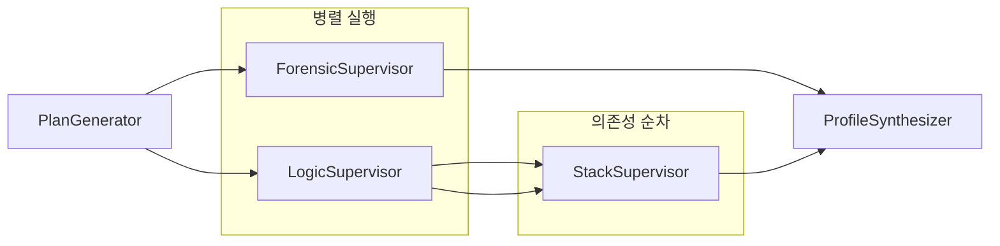

# Performance

> HMAS 파이프라인 성능 최적화 전략.
> Fan-out 병렬화, Reference Passing, Redis 캐싱, Funnel Selection 토큰 절감.

## 성능 벤치마크 목표

| 항목 | v4.0 (Temporal) 기준선 | v5.0 (LangGraph) 목표 |
|------|:---:|:---:|
| 전체 파이프라인 실행 시간 (3 repos) | ~15분 | ~10분 (33% 단축) |
| Worker 병렬화 효율 | 순차 실행 | Fan-out 3-5x 병렬 |
| State Checkpoint 크기 | N/A | < 10KB (Reference Passing) |
| LLM 토큰 사용량 (분석당) | ~50K tokens | ~30K tokens (Funnel Selection) |
| 동시 Job 처리 | 1개 (Temporal Worker) | 3개+ (LangGraph thread) |

## 병렬화 전략 (Fan-out / Fan-in)



**Supervisor 내부 병렬화:**

| Supervisor | Worker | 실행 방식 |
|-----------|--------|----------|
| ForensicSupervisor | Collector -> IdentityResolver -> SemanticPruner | 순차 |
| ForensicSupervisor | Vibector, CLAVE, Datasketch | **완전 병렬** |
| LogicSupervisor | ASTAnalyzer, ComplexityMeter, QualityScanner | **완전 병렬** |
| StackSupervisor | SkillExtractor, APIDepthAnalyzer, ArchitectureEvaluator | **완전 병렬** |

## Reference Passing 패턴

> ADR-0004: State 객체에 Raw Data를 넣으면 Checkpoint 크기가 폭발한다.

```python
# AS-IS: State에 Raw Data 직접 저장 (금지)
class BadState(TypedDict):
    ast_result: list[dict]  # 수십 MB 가능

# TO-BE: DB ID만 저장 (Reference Passing)
class MetaState(TypedDict):
    logic_result_ref: Optional[str]  # UUID만 전달
```

노드 실행 패턴: **Load -> Process -> Save -> Return Ref**

```python
async def logic_supervisor_node(state: MetaState) -> dict:
    job_id = state["job_id"]
    repo_files = await repo_repository.get_files(job_id)       # 1. Load
    ast_result = await ast_analyzer.analyze(repo_files)         # 2. Process
    result_id = await analysis_repository.save_result(          # 3. Save
        job_id, "logic_supervisor", ast_result
    )
    return {"logic_result_ref": result_id}                      # 4. Return Ref
```

## Redis 캐싱

| 캐싱 대상 | TTL | 키 패턴 |
|----------|-----|--------|
| LLM 응답 | 24시간 | `llm:{model}:{prompt_hash}` |
| GitHub API 응답 | 1시간 | `github:{endpoint}:{params_hash}` |
| 분석 결과 조회 | 30분 | `analysis:{job_id}:{worker}` |

```python
# infrastructure/llm/cached_client.py
class CachedLLMClient:
    def __init__(self, client: InstructorClient, redis: Redis):
        self._client = client
        self._redis = redis

    async def complete(self, prompt: str, model: str, **kwargs) -> BaseModel:
        cache_key = f"llm:{model}:{hashlib.sha256(prompt.encode()).hexdigest()}"
        cached = await self._redis.get(cache_key)
        if cached:
            return json.loads(cached)
        result = await self._client.complete(prompt, model, **kwargs)
        await self._redis.setex(cache_key, 86400, result.model_dump_json())
        return result
```

## Funnel Selection 토큰 절감

3단계 Funnel로 분석 대상 코드를 사전 필터링하여 LLM 토큰 사용량 40% 절감:

```
입력: 10개 레포 (수천 파일)
  ↓ Stage 1: Hard Filter (Fork 제거, 언어 필터)
5개 레포
  ↓ Stage 2: Relevance Scoring (JD 매칭)
3개 레포
  ↓ Stage 3: Vector Similarity (pgvector)
핵심 파일 ~200개만 분석
```

## 관련 문서

- [[decisions/0004-reference-passing]] -- Reference Passing ADR
- [[application/hmas-graph/MOC]] -- HMAS 병렬 실행 구조
- [[crosscutting/testing-strategy]] -- 성능 벤치마크 테스트
