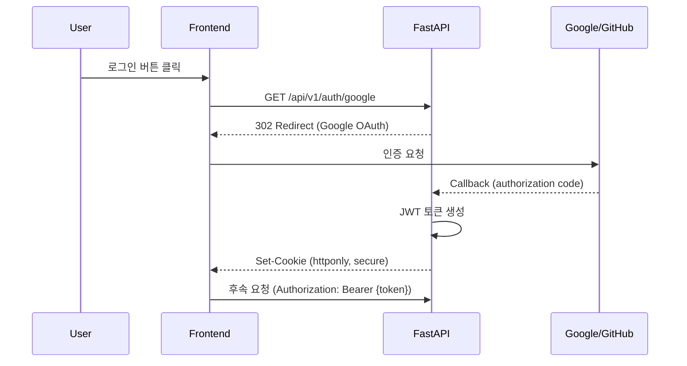
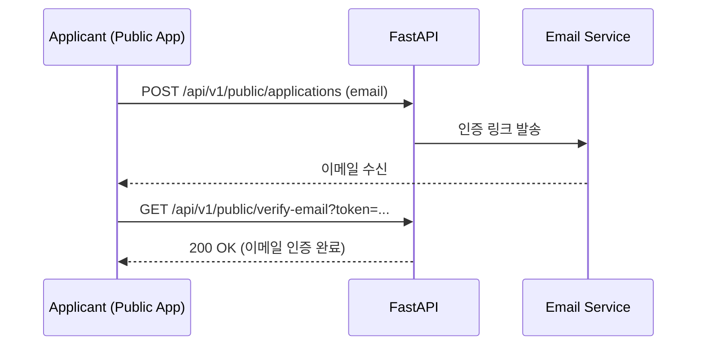

# Security

> 인증/인가, API 보안, 데이터 보호 전략.
> OAuth 2.0 + JWT 기반 인증, CORS, Rate Limiting 적용.

## 인증 아키텍처



## OAuth 2.0 설정

| Provider | Client ID 환경변수 | Scopes |
|----------|-------------------|--------|
| Google | `GOOGLE_CLIENT_ID` | `openid`, `email`, `profile` |
| GitHub | `GITHUB_CLIENT_ID` | `read:user`, `user:email` |

## JWT 토큰 구조

```python
# interface/api/middleware/auth.py
from jose import jwt
from datetime import datetime, timedelta

JWT_SECRET = os.getenv("JWT_SECRET")
JWT_ALGORITHM = "HS256"
JWT_EXPIRATION = timedelta(hours=24)

def create_token(user_id: str, email: str) -> str:
    payload = {
        "sub": user_id,
        "email": email,
        "exp": datetime.utcnow() + JWT_EXPIRATION,
        "iat": datetime.utcnow(),
    }
    return jwt.encode(payload, JWT_SECRET, algorithm=JWT_ALGORITHM)

async def get_current_user(token: str = Depends(oauth2_scheme)) -> User:
    payload = jwt.decode(token, JWT_SECRET, algorithms=[JWT_ALGORITHM])
    user = await user_repository.get(payload["sub"])
    if not user:
        raise HTTPException(status_code=401)
    return user
```

## Public API (비인증 접근)

지원자용 Public App은 일부 엔드포인트에 인증 없이 접근 가능:

| 엔드포인트 | 설명 | 인증 |
|-----------|------|------|
| `POST /api/v1/public/applications` | 지원서 제출 | 불필요 |
| `GET /api/v1/public/jobs/{job_id}` | 공고 상세 조회 | 불필요 |
| `POST /api/v1/public/verify-email` | 이메일 인증 토큰 확인 | 불필요 |

### 이메일 인증 플로우



## API 보안 계층

| 계층 | 기술 | 설정 |
|------|------|------|
| CORS | FastAPI CORSMiddleware | 프로덕션: 허용 도메인 제한 |
| Rate Limiting | Redis 기반 | 인증 사용자: 100 req/min / Public: 20 req/min |
| Input Validation | Pydantic v2 strict mode | 모든 요청 스키마 검증 |
| SQL Injection | Parameterized queries (psycopg3) | ORM 미사용, 직접 쿼리 |
| GitHub Token | 서버사이드 환경변수 | 클라이언트 노출 금지 |

## 환경변수 보안

| 변수 | 용도 | 위치 |
|------|------|------|
| `JWT_SECRET` | JWT 서명 키 | `.env` (Git 미추적) |
| `GITHUB_TOKEN` | GitHub API 접근 | `.env` |
| `KIMI_API_KEY` | LLM API 키 | `.env` |
| `LANGFUSE_SECRET_KEY` | Langfuse 추적 | `.env` |
| `TUNNEL_TOKEN` | Cloudflare Tunnel | `infra-tunnel/.env` |

## Cloudflare Zero Trust

Cloudflare Tunnel을 통한 Zero Trust 네트워크:

```
User → Cloudflare Edge → cloudflared → frontend:80
                                         ↓ (internal_net)
                                       backend:8000
                                         ↓
                                       postgres / redis
```

- 외부에서 직접 포트 접근 불가 (포트 포워딩 불필요)
- Cloudflare Access 정책으로 접근 제어 가능
- DDoS 보호 기본 제공

## 관련 문서

- [[interface/rest-api/endpoints]] -- 인증 필요 엔드포인트
- [[crosscutting/deployment]] -- Cloudflare Tunnel 배포
