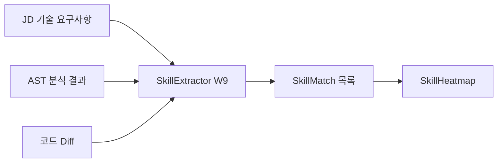

# SkillHeatmap.tsx -- 기술스택 히트맵 (JD 매칭)

> SkillExtractor Worker (W9) 결과를 D3 Heatmap으로 시각화.
> JD 요구 기술 스택과 후보자 실제 사용 기술의 매칭도를 행렬 형태로 표시.
> Tab 3 (Code Deep Dive)에 배치.

## 시각화 개념

```
               경험 수준
기술스택      None  Basic  Inter  Adv   Expert
──────────────────────────────────────────────
Python              ░░░░   ████   ████          JD: 필수
React               ░░░░   ████                 JD: 필수
PostgreSQL                  ████                 JD: 우대
Redis         ░░░░                               JD: 우대
Kubernetes                                ████   JD: 필수  ⚠️ Gap
Docker                      ████                 JD: 우대
──────────────────────────────────────────────

색상: 짙은 초록(Expert) → 빨강(Gap: JD 필수인데 경험 없음)
```

## Props 인터페이스

```typescript
// frontend/src/components/charts/SkillHeatmap.tsx
interface SkillMatch {
  skill_name: string;
  jd_priority: 'required' | 'preferred' | 'nice-to-have';
  proficiency: 'none' | 'beginner' | 'intermediate' | 'advanced' | 'expert';
  evidence_count: number;      // Git 커밋에서 발견된 사용 횟수
  evidence_sources: string[];  // 증거 출처 (git, resume, linkedin)
  repos: string[];             // 사용된 레포 목록
}

interface SkillHeatmapProps {
  data: SkillMatch[];
  width?: number;
  height?: number;
}
```

## D3.js 구현 핵심

```typescript
import * as d3 from 'd3';

const PROFICIENCY_ORDER = ['none', 'beginner', 'intermediate', 'advanced', 'expert'];
const PROFICIENCY_LABELS = ['없음', '기초', '중급', '고급', '전문'];

export function SkillHeatmap({ data, width = 600, height }: SkillHeatmapProps) {
  const svgRef = useRef<SVGSVGElement>(null);
  const cellSize = 50;
  const computedHeight = height || data.length * cellSize + 80;

  useEffect(() => {
    if (!svgRef.current) return;
    const svg = d3.select(svgRef.current);
    svg.selectAll('*').remove();

    const margin = { top: 60, right: 100, left: 120, bottom: 20 };
    const g = svg.append('g')
      .attr('transform', `translate(${margin.left},${margin.top})`);

    // 색상: Gap(빨강) → None(회색) → Expert(짙은 초록)
    const colorMap: Record<string, string> = {
      'none': '#f3f4f6',
      'beginner': '#bbf7d0',
      'intermediate': '#4ade80',
      'advanced': '#16a34a',
      'expert': '#166534',
    };

    // X축 (경험 수준)
    PROFICIENCY_LABELS.forEach((label, i) => {
      g.append('text')
        .attr('x', i * cellSize + cellSize / 2)
        .attr('y', -10)
        .attr('text-anchor', 'middle')
        .attr('class', 'text-xs')
        .text(label);
    });

    // 행별 렌더링
    data.forEach((skill, rowIdx) => {
      const y = rowIdx * cellSize;

      // 기술명
      g.append('text')
        .attr('x', -10)
        .attr('y', y + cellSize / 2)
        .attr('text-anchor', 'end')
        .attr('dominant-baseline', 'middle')
        .attr('class', 'text-xs font-medium')
        .text(skill.skill_name);

      // 경험 수준 셀
      PROFICIENCY_ORDER.forEach((prof, colIdx) => {
        const isActive = PROFICIENCY_ORDER.indexOf(skill.proficiency) >= colIdx
          && skill.proficiency !== 'none';
        const isGap = skill.jd_priority === 'required' && skill.proficiency === 'none';

        g.append('rect')
          .attr('x', colIdx * cellSize + 2)
          .attr('y', y + 2)
          .attr('width', cellSize - 4)
          .attr('height', cellSize - 4)
          .attr('rx', 4)
          .attr('fill', isGap ? '#fecaca' : isActive ? colorMap[prof] : '#f9fafb')
          .attr('stroke', isGap ? '#ef4444' : '#e5e7eb')
          .attr('stroke-width', isGap ? 2 : 0.5);
      });

      // JD 우선순위 표시
      const priorityLabel = {
        'required': '필수',
        'preferred': '우대',
        'nice-to-have': '선택',
      }[skill.jd_priority];

      g.append('text')
        .attr('x', PROFICIENCY_ORDER.length * cellSize + 10)
        .attr('y', y + cellSize / 2)
        .attr('dominant-baseline', 'middle')
        .attr('class', `text-xs ${skill.jd_priority === 'required' ? 'font-bold text-red-600' : ''}`)
        .text(`JD: ${priorityLabel}`);

      // Gap 경고
      if (skill.jd_priority === 'required' && skill.proficiency === 'none') {
        g.append('text')
          .attr('x', PROFICIENCY_ORDER.length * cellSize + 70)
          .attr('y', y + cellSize / 2)
          .attr('dominant-baseline', 'middle')
          .attr('class', 'text-xs text-red-500')
          .text('Gap');
      }
    });
  }, [data, width]);

  return <svg ref={svgRef} width={width} height={computedHeight} />;
}
```

## JD 매칭 분석 흐름



## Gap 분석 규칙

| JD 우선순위 | 후보자 경험 | 상태 | 면접 시 액션 |
|------------|----------|------|------------|
| required | none | **Critical Gap** | 반드시 질문으로 검증 |
| required | beginner | Minor Gap | 심화 질문 |
| preferred | none | Acceptable | 참고 |
| nice-to-have | none | 무시 | - |

## 데이터 소스

- **Worker**: W9 (SkillExtractorWorker)
- **Supervisor**: StackSupervisor
- **의존**: LogicSupervisor의 AST 결과 (W6)
- **DB 테이블**: `analysis_results` (worker_name='skill_extractor')
- **API**: `GET /api/v1/jobs/{job_id}/analysis/skill_extractor`

## 관련 문서

- [[domain/scoring-system/mastery-metric]] -- 전문성 지표 산출
- [[domain/funnel-selection/relevance-scoring]] -- JD 매칭 관련성 점수
- [[interface/d3-charts/MOC]] -- D3 차트 전체 목록
