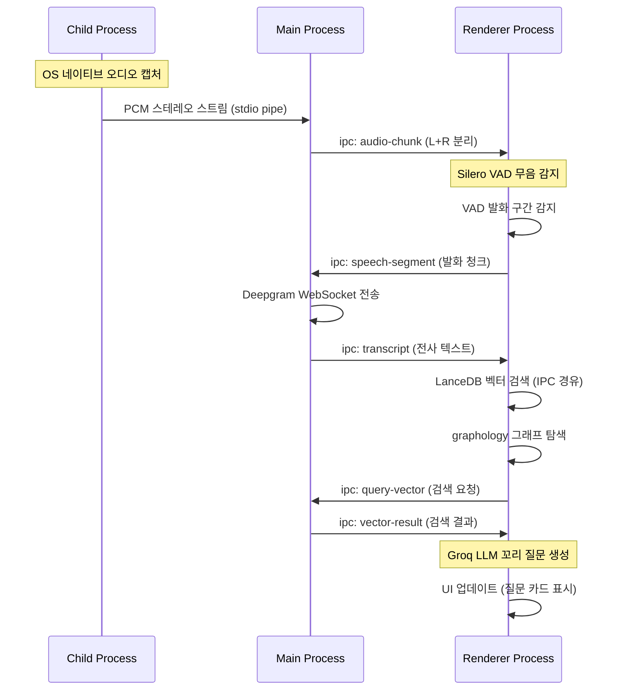

# Electron Architecture: Main / Renderer / Child Process

> Electron v33+의 다중 프로세스(Multi-Process) 모델을 활용한 3계층 아키텍처.
> 무거운 작업(오디오 캡처)은 Child Process, UI는 Renderer, 조율은 Main Process.

## 프로세스 모델 다이어그램

```
┌─────────────────────────────────────────────────────────────┐
│                    Electron v33+ App                        │
│                                                             │
│  ┌─────────────────────────────────────────────────────┐    │
│  │           Renderer Process (React + Vite)           │    │
│  │                                                     │    │
│  │  ┌──────────┐  ┌──────────┐  ┌────────────────┐    │    │
│  │  │ Silero   │  │ grapho-  │  │  Interviewer   │    │    │
│  │  │ VAD      │  │ logy     │  │  Dashboard UI  │    │    │
│  │  │ (WASM)   │  │ (Graph)  │  │  (React)       │    │    │
│  │  └────┬─────┘  └────┬─────┘  └───────┬────────┘    │    │
│  │       │              │                │             │    │
│  │       └──────────────┴────────────────┘             │    │
│  │                    EventBus                         │    │
│  └─────────────────────┬───────────────────────────────┘    │
│                        │ IPC                                │
│  ┌─────────────────────┴───────────────────────────────┐    │
│  │              Main Process (Node.js)                 │    │
│  │                                                     │    │
│  │  ┌──────────┐  ┌──────────┐  ┌────────────────┐    │    │
│  │  │ Audio    │  │ LanceDB  │  │  Deepgram WS   │    │    │
│  │  │ Manager  │  │ v0.26    │  │  Client        │    │    │
│  │  │          │  │ (Vector) │  │  (STT)         │    │    │
│  │  └────┬─────┘  └──────────┘  └────────────────┘    │    │
│  └───────┼─────────────────────────────────────────────┘    │
│          │ stdio pipe                                       │
│  ┌───────┴─────────────────────────────────────────────┐    │
│  │        Child Process (Native Audio Binary)          │    │
│  │  macOS: ScreenCaptureKit / CoreAudio                │    │
│  │  Windows: WASAPI Loopback (추후)                     │    │
│  │  출력: PCM Stereo (L=Mic, R=System)                 │    │
│  └─────────────────────────────────────────────────────┘    │
└─────────────────────────────────────────────────────────────┘
```

## 각 프로세스 역할

### Child Process (Native Audio Binary)

| 항목 | 내용 |
|------|------|
| **역할** | OS 네이티브 오디오 캡처 |
| **기술** | C++/Swift 바이너리 |
| **macOS** | ScreenCaptureKit (macOS 13.0+) / CoreAudio |
| **Windows** | WASAPI 루프백 (추후) |
| **출력** | PCM 스테레오 스트림 (L=Mic, R=System) |
| **통신** | stdio pipe -> Main Process |

### Main Process (Node.js)

| 항목 | 내용 |
|------|------|
| **역할** | OS 환경 판별, Child Process 생명주기 관리, IPC 브리지 |
| **Audio Manager** | `process.platform` 판별 -> 적절한 바이너리 실행 |
| **LanceDB** | In-process 벡터 검색 (Node.js 네이티브 바인딩) |
| **Deepgram** | WebSocket STT 클라이언트 |
| **통신** | `ipcMain` / `ipcRenderer` |

### Renderer Process (React + Vite)

| 항목 | 내용 |
|------|------|
| **역할** | 면접관 대시보드 UI + 엣지 컴퓨팅 |
| **Silero VAD** | WASM 기반, 1ms 이하 무음 감지 |
| **graphology** | In-memory 그래프 탐색 (<5ms) |
| **UI** | React 19 + Tailwind 4 + Zustand 이벤트 버스 |
| **통신** | `ipcRenderer` -> Main Process |

## IPC 메시지 흐름



## 디렉토리 구조

```
desktop/
├── src/
│   ├── main/              # Electron Main Process
│   │   ├── index.ts       # 앱 진입점
│   │   ├── audio.ts       # Child Process 관리 (AudioManager)
│   │   ├── ipc.ts         # IPC 핸들러
│   │   └── lance-store.ts # LanceDB 인스턴스
│   ├── renderer/          # Renderer Process (React)
│   │   ├── App.tsx
│   │   ├── components/
│   │   │   ├── TopicCoverage.tsx    # 토픽 커버리지 바
│   │   │   ├── ProbingCards.tsx     # 동적 질문 카드
│   │   │   └── Scorecard.tsx        # 자동화 스코어카드
│   │   ├── hooks/
│   │   │   ├── useVAD.ts            # Silero VAD
│   │   │   ├── useSTT.ts            # Deepgram STT
│   │   │   └── useLanceDB.ts        # 로컬 벡터 검색
│   │   └── store/
│   │       └── liveStore.ts         # Pub/Sub 이벤트 버스 (Zustand)
│   └── native/            # C++/Swift 네이티브 오디오 모듈
│       ├── macos/          # ScreenCaptureKit
│       └── windows/        # WASAPI 루프백
├── package.json
└── electron-builder.yml
```

## 6레이어 추상화 아키텍처

변경 내성(Change Tolerance)을 위한 디자인 패턴 적용:

| 레이어 | 패턴 | 역할 |
|--------|------|------|
| Layer 6: UI (Presenter) | Observer | EventBus 구독만, 직접 의존 없음 |
| Layer 5: Application (Orchestrator) | Mediator | 파이프라인 조율, 컴포넌트 간 직접 참조 금지 |
| Layer 4: Domain (Business Logic) | Strategy | 면접 모드별/분석 전략별 교체 가능 |
| Layer 3: Service (Use Cases) | Template Method | 공통 흐름 고정, 세부 단계만 Override |
| Layer 2: Port (Interface Contracts) | Port/Adapter | 모든 외부 의존을 Interface로 차단 |
| Layer 1: Adapter (Infrastructure) | Adapter | 실제 구현체, 교체 시 여기만 수정 |

## Port/Adapter 교체 가능 목록

| Port | 현재 Adapter | 교체 후보 | 영향 범위 |
|------|-------------|----------|----------|
| STTProvider | DeepgramAdapter | WhisperAdapter, AssemblyAIAdapter | 1 파일 |
| LLMProvider (실시간) | GroqAdapter | TogetherAIAdapter, OllamaAdapter | 1 파일 |
| VADEngine | SileroWASMAdapter | WebRTCVADAdapter | 1 파일 |
| AudioCapturer | ScreenCaptureKitAdapter | WASAPIAdapter (Windows) | 1 파일 |
| VectorStore | LanceDBAdapter | ChromaAdapter, QdrantAdapter | 1 파일 |
| GraphStore | GraphologyAdapter | - | 1 파일 |

## 온라인 vs 오프라인 면접

| 모드 | 화자 분리 방식 | 오디오 소스 |
|------|---------------|------------|
| 온라인 (화상) | Channel Muxing (L=Mic, R=System) | 마이크 + 시스템 사운드 |
| 오프라인 (대면) | Deepgram AI Diarization | 마이크만 (양자 음성 모두 캡처) |

## 관련 문서

- [[interface/electron-app/audio-capture]] -- OS별 오디오 캡처 상세
- [[interface/electron-app/lancedb-local]] -- Local-First 벡터 검색
- [[interface/electron-app/tauri-migration]] -- Tauri 2.x 전환 로드맵
- [[decisions/0009-electron-vs-tauri]] -- 프레임워크 선택 근거
- [[infrastructure/voice-pipeline/MOC]] -- VAD/STT/LLM 파이프라인
