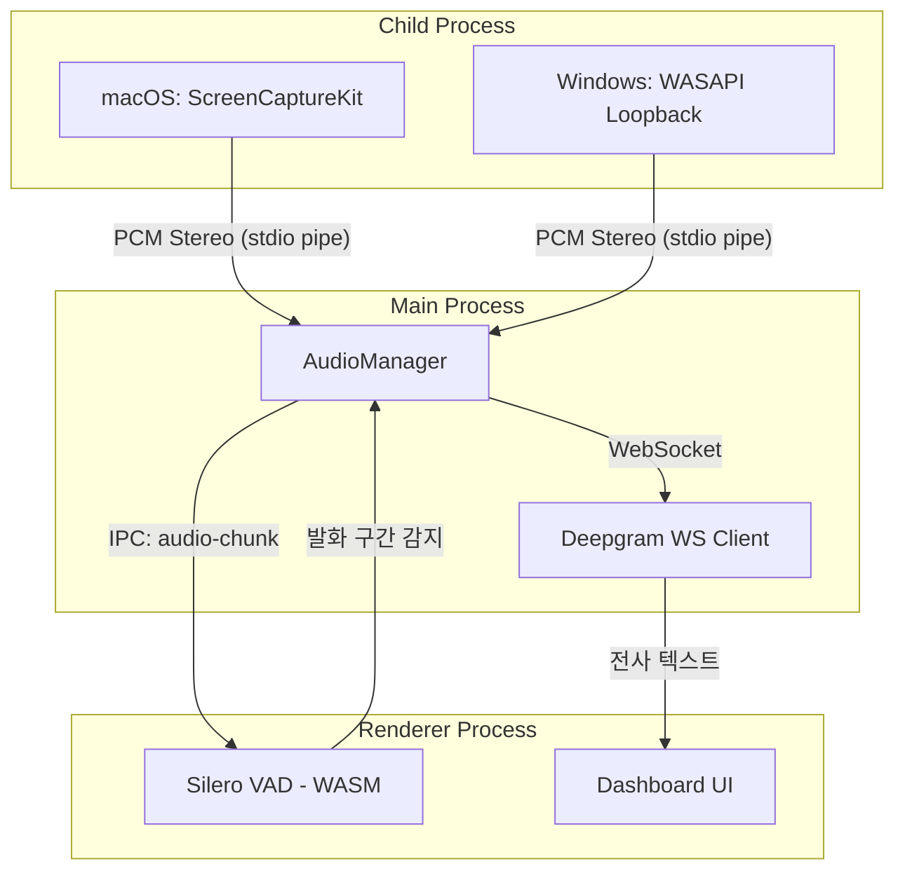

# Audio Capture: OS별 구현

> 서드파티 가상 드라이버 없이 시스템 오디오 + 마이크를 캡처하는 네이티브 모듈.
> Child Process로 실행되는 C++/Swift 바이너리가 PCM 스테레오 스트림을 Main Process에 전달.

## 캡처 아키텍처



## OS별 구현

### macOS (ScreenCaptureKit)

| 항목 | 값 |
|------|-----|
| **API** | ScreenCaptureKit (macOS 12.3+) / CoreAudio |
| **최소 OS** | macOS 13.0 (Ventura) 권장 |
| **라이브러리** | `electron-audio-loopback` v1.0.6 |
| **시스템 오디오** | ScreenCaptureKit -> 시스템 사운드 캡처 |
| **마이크** | `navigator.mediaDevices.getUserMedia()` / CoreAudio |
| **출력 형식** | PCM Stereo (L=Mic, R=System) |
| **드라이버** | 불필요 (OS 네이티브) |

```swift
// native/macos/AudioCapture.swift (개념 코드)
import ScreenCaptureKit

class SystemAudioCapture {
    private var stream: SCStream?

    func startCapture() async throws {
        let config = SCStreamConfiguration()
        config.capturesAudio = true
        config.sampleRate = 16000  // STT 최적 샘플레이트
        config.channelCount = 2    // Stereo (L=Mic, R=System)

        let filter = SCContentFilter(
            desktopIndependentWindow: nil  // 시스템 전체 오디오
        )

        stream = SCStream(filter: filter, configuration: config, delegate: self)
        try await stream?.startCapture()
    }
}
```

**Chromium 플래그 (대안):**
- `MacLoopbackAudioForScreenShare` -- macOS 루프백 캡처 활성화
- `MacSckSystemAudioLoopbackOverride` -- ScreenCaptureKit 강제 사용

### Windows (WASAPI Loopback)

| 항목 | 값 |
|------|-----|
| **API** | WASAPI (Windows Audio Session API) 루프백 |
| **최소 OS** | Windows 10+ |
| **라이브러리** | `electron-audio-loopback` v1.0.6 |
| **시스템 오디오** | WASAPI Loopback Device |
| **마이크** | WASAPI Capture Device |
| **출력 형식** | PCM Stereo (L=Mic, R=System) |

```cpp
// native/windows/AudioCapture.cpp (개념 코드)
#include <mmdeviceapi.h>
#include <audioclient.h>

class WASAPILoopback {
    IAudioClient* pAudioClient = nullptr;
    IAudioCaptureClient* pCaptureClient = nullptr;

public:
    HRESULT Initialize() {
        // Loopback device 열기
        IMMDeviceEnumerator* pEnumerator;
        CoCreateInstance(CLSID_MMDeviceEnumerator, ...);

        IMMDevice* pDevice;
        pEnumerator->GetDefaultAudioEndpoint(
            eRender,     // 출력 장치의 루프백
            eConsole,
            &pDevice
        );

        pDevice->Activate(IID_IAudioClient, ...);
        pAudioClient->Initialize(
            AUDCLNT_SHAREMODE_SHARED,
            AUDCLNT_STREAMFLAGS_LOOPBACK,  // 루프백 캡처
            ...
        );
        return S_OK;
    }
};
```

## AudioManager (Main Process)

```typescript
// desktop/src/main/audio.ts
import { spawn, ChildProcess } from 'child_process';
import { platform } from 'os';
import path from 'path';

export class AudioManager {
  private process: ChildProcess | null = null;

  start(): void {
    const binaryPath = this.getBinaryPath();
    this.process = spawn(binaryPath, [], {
      stdio: ['pipe', 'pipe', 'pipe'],
    });

    this.process.stdout?.on('data', (chunk: Buffer) => {
      // PCM 스테레오 데이터를 Renderer로 전달
      mainWindow.webContents.send('audio-chunk', chunk);
    });

    this.process.on('error', (err) => {
      console.error('Audio capture failed:', err);
      // Graceful Degradation: 마이크만으로 폴백
    });
  }

  stop(): void {
    this.process?.kill('SIGTERM');
    this.process = null;
  }

  private getBinaryPath(): string {
    const binDir = path.join(__dirname, '..', 'native');
    switch (platform()) {
      case 'darwin':
        return path.join(binDir, 'macos', 'audio-capture');
      case 'win32':
        return path.join(binDir, 'windows', 'audio-capture.exe');
      default:
        throw new Error(`Unsupported platform: ${platform()}`);
    }
  }
}
```

## 채널 멀티플렉싱 (Channel Muxing)

온라인 면접에서 화자 분리를 100% 보장하는 핵심 기법:

```
입력 1: 마이크 (면접관 음성)      → Left Channel  (채널 0)
입력 2: 시스템 사운드 (후보자 음성) → Right Channel (채널 1)

┌─────────────────────────┐
│  PCM Stereo Frame       │
│  [L0, R0, L1, R1, ...]  │
│   ↑        ↑             │
│   면접관   후보자          │
└─────────────────────────┘
```

STT에 멀티채널로 전송하면 화자별 전사를 별도 트랙으로 수신:
- Deepgram `multichannel=true` 옵션 활성화
- 채널 0 결과 = 면접관 발화
- 채널 1 결과 = 후보자 발화

## 레이턴시 예산

| 구간 | 목표 |
|------|------|
| 네이티브 캡처 -> Main Process | <10ms |
| Main -> Renderer (IPC) | <5ms |
| VAD 무음 감지 | <1ms |
| 총 오디오 파이프라인 | <16ms (1 프레임) |

## 관련 문서

- [[interface/electron-app/architecture]] -- 전체 프로세스 모델
- [[infrastructure/voice-pipeline/vad-silero]] -- VAD 무음 감지 상세
- [[infrastructure/voice-pipeline/stt-provider]] -- STT 프로바이더 추상화
- [[decisions/0009-electron-vs-tauri]] -- 프레임워크 선택 근거
