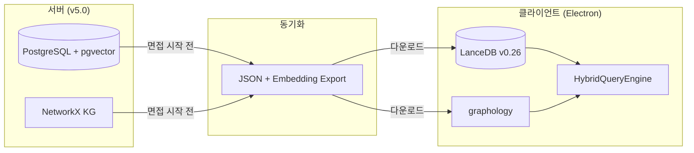
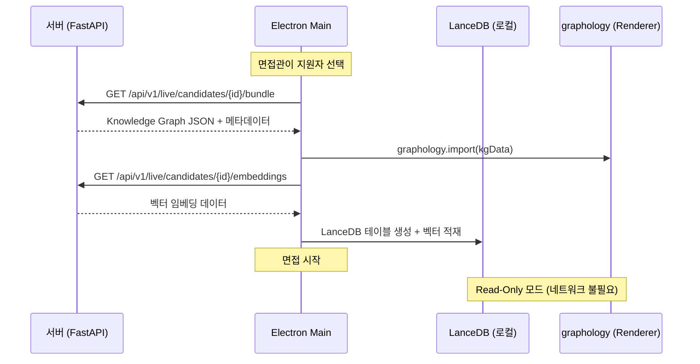

# LanceDB Local: Read-Heavy 전략

> Electron Main Process 내에서 LanceDB v0.26을 In-process로 구동.
> 면접 중 네트워크 의존 없이 <60ms 벡터 검색을 보장하는 Local-First 패턴.

## Local-First 아키텍처



## Read-Heavy 전략

면접 도중에는 **읽기만** 발생하고 쓰기는 면접 시작 전(동기화)과 종료 후(업로드)에만 발생:

| 단계 | 작업 | 방향 |
|------|------|------|
| **면접 준비** (Phase 2) | 서버 -> 로컬 LanceDB 적재 | Write (1회) |
| **면접 중** (Phase 3) | 벡터 검색 + 그래프 탐색 | Read-Only |
| **면접 종료** (Phase 4) | 로컬 전사 + 면접 데이터 업로드 | Upload |

## 데이터 동기화 흐름



## LanceDB 테이블 구조

```typescript
// desktop/src/main/lance-store.ts
import * as lancedb from '@lancedb/lancedb';

interface CandidateEmbedding {
  id: string;
  kind: 'code' | 'resume' | 'linkedin' | 'jd';
  content: string;
  metadata: Record<string, unknown>;
  vector: number[];  // 1536-dim
}

export class LanceStore {
  private db: lancedb.Connection;
  private table: lancedb.Table | null = null;

  async initialize(dbPath: string): Promise<void> {
    this.db = await lancedb.connect(dbPath);
  }

  async loadCandidateData(embeddings: CandidateEmbedding[]): Promise<void> {
    this.table = await this.db.createTable('candidate', embeddings, {
      mode: 'overwrite',
    });
    // IVF 인덱스 생성 (검색 최적화)
    await this.table.createIndex('vector', {
      type: 'ivf_pq',
      num_partitions: 16,
    });
  }

  async search(queryVector: number[], limit: number = 5): Promise<CandidateEmbedding[]> {
    if (!this.table) throw new Error('Table not loaded');
    return await this.table
      .search(queryVector)
      .limit(limit)
      .toArray();
  }

  async searchByKind(
    queryVector: number[],
    kind: string,
    limit: number = 3
  ): Promise<CandidateEmbedding[]> {
    if (!this.table) throw new Error('Table not loaded');
    return await this.table
      .search(queryVector)
      .where(`kind = '${kind}'`)
      .limit(limit)
      .toArray();
  }
}
```

## 하이브리드 검색 실행 흐름

면접 중 실제 검색 시뮬레이션:

```
지원자 발화: "Redis를 써서 속도를 많이 높였고, 혼자서 캐싱 레이어를 다 구축했습니다"

Step 1: STT 수신 (300ms)

Step 2: LanceDB 벡터 검색 (20ms)
  → 이력서 청크: "ABC 회사 팀 프로젝트로 Redis 캐시 구현"
  → 코드 분석: "redis_cache.py — CC:8, 순수 기여도 95%"
  → LinkedIn: "ABC Corp — Backend Developer"

Step 3: graphology 그래프 탐색 (5ms)
  → (Candidate)─[HAS_SKILL]→(Redis)─[EVIDENCE]→(GitCommit{blame: 95%})
  → (Candidate)─[CLAIMED]→(Claim{"팀 프로젝트", src: resume})
  → (Claim{"팀 프로젝트"})─[CONTRADICTS]→(발화{"혼자 구축"})
  → (Redis)─[REQUIRED_BY]→(JD{priority: high})

Step 4: 하이브리드 컨텍스트 → Groq LLM (640ms)
  → 모순 정보 + 코드 증거 → 꼬리질문 생성

전체: ~670ms (발화 종료 → 질문 카드 표시)
```

## LanceDB 선택 근거

| 항목 | LanceDB v0.26 | ChromaDB v3.3 | Qdrant |
|------|:---:|:---:|:---:|
| **서버 불필요** | In-process | 서버 또는 임베디드 | REST API (서버 필수) |
| **Node.js/Electron** | `@lancedb/lancedb` npm | `chromadb` npm | REST API만 |
| **쿼리 성능** | ~60ms | ~150ms | 20-30ms (서버 경유) |
| **디스크 형식** | Apache Arrow (컬럼나) | Parquet | Custom |
| **Electron 검증** | Continue.dev 사례 | 사례 적음 | N/A |

## 성능 목표

| 항목 | 목표 |
|------|------|
| 벡터 검색 레이턴시 | <60ms |
| 테이블 로딩 (1000 임베딩) | <2초 |
| 메모리 사용 | <50MB |
| 디스크 사용 | <20MB per candidate |

## 관련 문서

- [[infrastructure/vector-search/MOC]] -- 서버 측 pgvector 검색
- [[infrastructure/vector-search/embedding-strategy]] -- 임베딩 생성 전략
- [[interface/electron-app/architecture]] -- 전체 프로세스 모델
- [[infrastructure/voice-pipeline/groq-realtime]] -- 검색 결과 -> LLM 질문 생성
