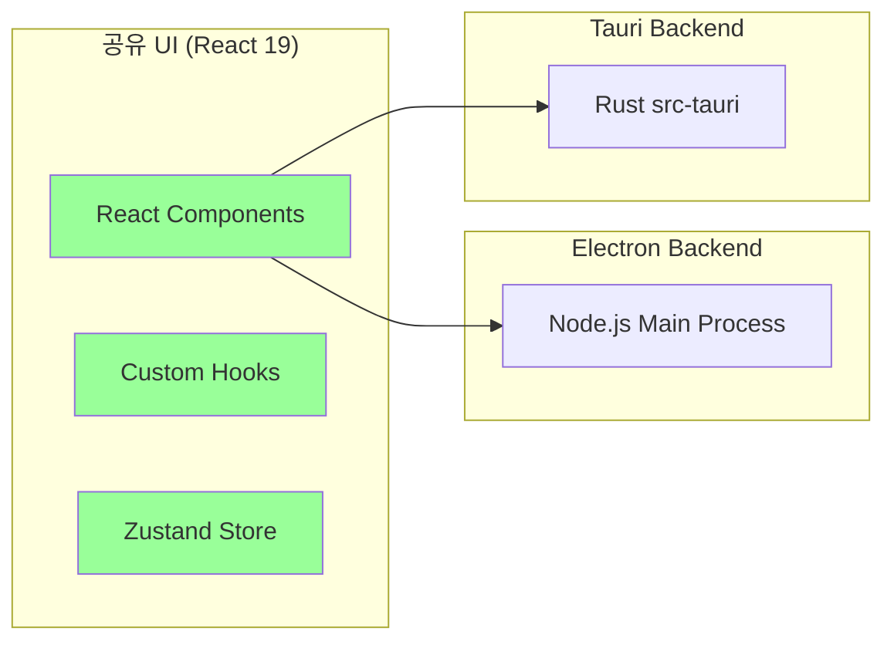

# Tauri 2.x Migration Roadmap

> ADR-0009 결정: "Electron v33으로 시작, Tauri 2.x 마이그레이션 로드맵 유지"
> 이 문서는 Electron MVP 안정화 후 Tauri 전환을 위한 체크리스트와 계획을 정리한다.

## Electron vs Tauri 비교 요약

| 항목 | Electron v33 | Tauri 2.x |
|------|:---:|:---:|
| **번들 크기** | 100MB+ | 2-10MB (**96% 감소**) |
| **메모리 사용** | 200-400MB | 30-40MB |
| **시작 시간** | 1-2초 | 0.5초 이하 |
| **렌더링** | Chromium 내장 | OS 네이티브 WebView |
| **백엔드** | Node.js | Rust |
| **보안** | Node.js 전체 접근 | Capability 기반 API |
| **오디오 캡처** | `electron-audio-loopback` 즉시 사용 | Rust 플러그인 직접 개발 필요 |
| **생태계** | 매우 성숙 | 빠르게 성장 중 |

## 왜 Electron으로 먼저 시작하는가

1. **MVP 우선 원칙**: 기술 위험보다 빠른 검증이 중요
2. **오디오 캡처**: `electron-audio-loopback`이 macOS/Windows 즉시 지원
3. **LanceDB**: Node.js 네이티브 바인딩 검증 완료 (Continue.dev 사례)
4. **팀 역량**: Rust 경험 없이 즉시 개발 가능
5. **기존 기술 재사용**: React 19 + npm 생태계

## 마이그레이션 전제 조건 (체크리스트)

Tauri 전환을 검토할 때 다음이 **모두 충족**되어야 한다:

- [ ] Electron MVP 사용자 테스트 완료
- [ ] 번들 크기/메모리 개선 필요성 사용자 피드백으로 확인
- [ ] Tauri 공식 오디오 캡처 플러그인 안정화
  - [ ] macOS ScreenCaptureKit 플러그인
  - [ ] Windows WASAPI 루프백 플러그인
- [ ] LanceDB Rust 바인딩 안정화 (`lancedb` crate)
- [ ] 팀 내 Rust 역량 확보 (Tauri 플러그인 개발 가능 수준)
- [ ] Silero VAD WASM이 Tauri WebView에서 정상 동작 검증

## 마이그레이션 단계 계획

### Phase 1: 병행 운영 준비

```
desktop/
├── electron/          # 기존 Electron 앱 (유지)
└── tauri/             # Tauri 2.x 프로토타입 (신규)
    ├── src-tauri/     # Rust 백엔드
    │   ├── src/
    │   │   ├── main.rs
    │   │   ├── audio/     # Rust 오디오 캡처 플러그인
    │   │   └── lance/     # LanceDB Rust 바인딩
    │   ├── Cargo.toml
    │   └── tauri.conf.json
    └── src/            # 공유 React UI (동일)
```

### Phase 2: 핵심 기능 포팅

| 기능 | Electron 구현 | Tauri 구현 |
|------|-------------|-----------|
| 오디오 캡처 | `electron-audio-loopback` | Tauri Rust 플러그인 |
| LanceDB | `@lancedb/lancedb` (npm) | `lancedb` (Rust crate) |
| IPC | `ipcMain/ipcRenderer` | Tauri Commands/Events |
| VAD | Silero WASM (Renderer) | Silero WASM (WebView) |
| STT | Deepgram WS (Node.js) | Deepgram WS (Rust) |

### Phase 3: UI 공유 + 전환



UI 레이어는 Renderer/WebView에서 동일하게 실행되므로, React 컴포넌트와 Hook은 **공유 가능**. 백엔드(Main Process)만 Node.js -> Rust로 교체.

## 포팅 시 주의사항

### macOS WebView 호환성

Tauri는 macOS에서 WKWebView를 사용하므로:
- CSS Grid/Flexbox: Safari 호환성 검증 필요
- WebAssembly: WKWebView에서 Silero WASM 성능 검증
- DevTools: Safari Web Inspector 사용 (Chrome DevTools 불가)

### IPC 패턴 변경

```typescript
// Electron IPC
ipcRenderer.send('query-vector', { query, limit });
ipcRenderer.on('vector-result', (_, data) => { ... });

// Tauri Commands (변경 후)
import { invoke } from '@tauri-apps/api/core';
const result = await invoke('query_vector', { query, limit });
```

### 보안 모델 차이

| 항목 | Electron | Tauri |
|------|---------|-------|
| API 접근 | Node.js 전체 | Capability 허용 목록 |
| 파일 접근 | 무제한 | 허용된 경로만 |
| 네트워크 | 무제한 | allowlist 기반 |

## 타임라인 (예상)

| 마일스톤 | 시점 | 조건 |
|---------|------|------|
| Electron MVP 완성 | M+3 | 오디오 캡처 + STT + RAG + LLM |
| 사용자 테스트 | M+4 | 10명+ 면접관 피드백 |
| Tauri 프로토타입 시작 | M+6 | 전제 조건 충족 시 |
| Tauri 베타 | M+9 | 핵심 기능 포팅 완료 |
| Electron 지원 종료 | M+12 | Tauri 안정화 확인 후 |

## 관련 문서

- [[decisions/0009-electron-vs-tauri]] -- 프레임워크 선택 ADR
- [[interface/electron-app/architecture]] -- 현재 Electron 아키텍처
- [[interface/electron-app/audio-capture]] -- 포팅 대상 오디오 캡처
