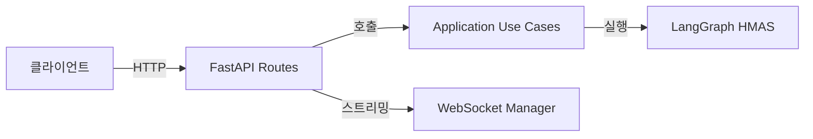

# REST API

> FastAPI 기반 RESTful API. Job CRUD, 인증, 헬스체크 엔드포인트 제공.
> Application Layer의 유스케이스를 HTTP 인터페이스로 노출한다.

## 아키텍처 위치



## 핵심 라우트 그룹

| 라우트 그룹 | 경로 | 역할 |
|------------|------|------|
| Jobs | `/api/v1/jobs/` | 분석 Job 생성, 조회, 삭제 |
| Auth | `/api/v1/auth/` | OAuth 인증 (Google, GitHub) |
| Health | `/health` | 서비스 헬스체크 |
| Live | `/api/v1/live/` | Jittda Live 세션 관리 |

## 문서 목록

| 문서 | 내용 |
|------|------|
| [[rest-api/endpoints\|Endpoints]] | FastAPI 라우트 전체 목록 + HTTP 메서드 |
| [[rest-api/schemas\|Schemas]] | Pydantic 요청/응답 스키마 정의 |

## 문서 목록 (자동)

```dataview
TABLE status, updated, tags
FROM "docs/architecture/interface/rest-api"
WHERE file.name != "MOC"
SORT file.name ASC
```

## 관련 ADR

```dataview
LIST
FROM "docs/architecture/decisions"
WHERE contains(impacts, this.file.link)
SORT date DESC
```
