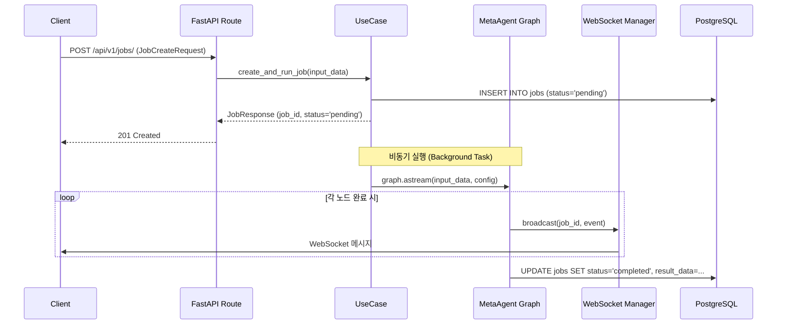

# FastAPI Endpoints

> `interface/api/routes/` 디렉토리의 라우트 정의.
> 모든 엔드포인트는 Application Layer 유스케이스만 호출한다 (DDD 의존성 규칙).

## 디렉토리 구조

```
src/interface/api/
├── routes/
│   ├── jobs.py        # Job CRUD + 분석 트리거 + WebSocket 스트리밍
│   ├── auth.py        # OAuth 인증 (Google, GitHub)
│   └── health.py      # 헬스체크
├── middleware/         # CORS, Rate Limit, Error Handler
├── schemas/           # Pydantic 요청/응답 스키마
└── main.py            # FastAPI 앱 인스턴스
```

## 엔드포인트 전체 목록

### Jobs (`/api/v1/jobs`)

| Method | Path | 설명 | 요청 스키마 | 응답 스키마 |
|--------|------|------|-----------|-----------|
| `POST` | `/api/v1/jobs/` | 분석 Job 생성 + HMAS 실행 트리거 | `JobCreateRequest` | `JobResponse` |
| `GET` | `/api/v1/jobs/` | 사용자 Job 목록 조회 | Query: `status`, `limit`, `offset` | `list[JobSummary]` |
| `GET` | `/api/v1/jobs/{job_id}` | 개별 Job 상세 조회 | - | `JobDetailResponse` |
| `DELETE` | `/api/v1/jobs/{job_id}` | Job 삭제 | - | `204 No Content` |
| `GET` | `/api/v1/jobs/{job_id}/scores` | 4대 지표 점수 조회 | - | `CandidateScoresResponse` |
| `GET` | `/api/v1/jobs/{job_id}/analysis/{worker}` | Worker별 분석 결과 | Path: `worker` | `AnalysisResultResponse` |
| `WS` | `/api/v1/jobs/{job_id}/stream` | 실시간 진행률 스트리밍 | - | WebSocket 메시지 |

### Auth (`/api/v1/auth`)

| Method | Path | 설명 | 비고 |
|--------|------|------|------|
| `GET` | `/api/v1/auth/google` | Google OAuth 리디렉트 | OAuth 2.0 |
| `GET` | `/api/v1/auth/google/callback` | Google 콜백 | JWT 토큰 발급 |
| `GET` | `/api/v1/auth/github` | GitHub OAuth 리디렉트 | OAuth 2.0 |
| `GET` | `/api/v1/auth/github/callback` | GitHub 콜백 | JWT 토큰 발급 |

### Live (`/api/v1/live`) -- Jittda Live 면접 세션

| Method | Path | 설명 |
|--------|------|------|
| `POST` | `/api/v1/live/sessions` | 라이브 면접 세션 생성 |
| `GET` | `/api/v1/live/sessions/{session_id}` | 세션 상태 조회 |
| `POST` | `/api/v1/live/sessions/{session_id}/end` | 세션 종료 + 후처리 트리거 |
| `GET` | `/api/v1/live/candidates/{id}/bundle` | 분석 번들 다운로드 (LanceDB 용) |
| `GET` | `/api/v1/live/candidates/{id}/embeddings` | 벡터 데이터 다운로드 |

### Health

| Method | Path | 설명 |
|--------|------|------|
| `GET` | `/health` | 서비스 상태 (DB, Redis, LangGraph) |

## Job 생성 + HMAS 실행 흐름



## FastAPI 앱 구성 코드

```python
# interface/api/main.py
from fastapi import FastAPI
from fastapi.middleware.cors import CORSMiddleware

app = FastAPI(
    title="Jittda Sniper v5.0",
    version="5.0.0",
    docs_url="/docs",
)

app.add_middleware(
    CORSMiddleware,
    allow_origins=["*"],  # 프로덕션에서 제한
    allow_methods=["*"],
    allow_headers=["*"],
)

# 라우트 등록
from interface.api.routes import jobs, auth, health
app.include_router(jobs.router, prefix="/api/v1/jobs", tags=["jobs"])
app.include_router(auth.router, prefix="/api/v1/auth", tags=["auth"])
app.include_router(health.router, tags=["health"])
```

## Job CRUD 라우트 코드

```python
# interface/api/routes/jobs.py
from fastapi import APIRouter, WebSocket, Depends, BackgroundTasks
from langgraph.checkpoint.postgres.aio import AsyncPostgresSaver

router = APIRouter()

@router.post("/", response_model=JobResponse, status_code=201)
async def create_job(
    request: JobCreateRequest,
    background_tasks: BackgroundTasks,
    user: User = Depends(get_current_user),
):
    job = await job_repository.create(user.id, request.input_data)
    background_tasks.add_task(run_analysis, job.id, request.input_data)
    return JobResponse(id=job.id, status="pending")

@router.get("/{job_id}", response_model=JobDetailResponse)
async def get_job(job_id: str, user: User = Depends(get_current_user)):
    job = await job_repository.get(job_id, user.id)
    return JobDetailResponse.from_orm(job)

@router.websocket("/{job_id}/stream")
async def stream_job(websocket: WebSocket, job_id: str):
    await websocket.accept()
    await ws_manager.connect(job_id, websocket)
    try:
        while True:
            await websocket.receive_text()  # Keep-alive
    except WebSocketDisconnect:
        ws_manager.disconnect(job_id, websocket)
```

## HMAS 비동기 실행 함수

```python
# interface/api/routes/jobs.py (continued)
async def run_analysis(job_id: str, input_data: dict):
    """Background task: LangGraph HMAS 파이프라인 실행."""
    async with AsyncPostgresSaver.from_conn_string(DB_URI) as checkpointer:
        graph = build_meta_graph().compile(checkpointer=checkpointer)
        config = {"configurable": {"thread_id": job_id}}

        async for event in graph.astream(input_data, config, stream_mode="updates"):
            # WebSocket으로 실시간 전송
            await ws_manager.broadcast(job_id, event)
```

## 관련 문서

- [[interface/rest-api/schemas]] -- Pydantic 요청/응답 스키마
- [[interface/websocket/realtime-protocol]] -- WebSocket 메시지 프로토콜
- [[application/hmas-graph/MOC]] -- HMAS Graph (실행 대상)
- [[crosscutting/security]] -- 인증/인가
