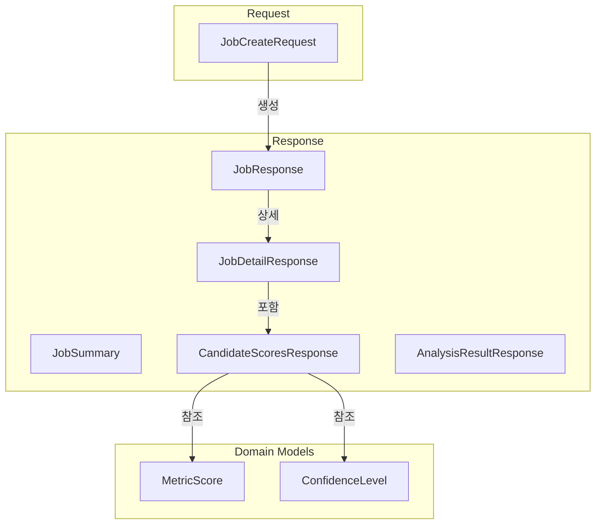

# API Schemas (Pydantic v2)

> `interface/api/schemas/` 디렉토리의 요청/응답 스키마 정의.
> Pydantic v2 + `ConfigDict(strict=True)` 사용.

## 스키마 계층 구조



## Job 스키마

### JobCreateRequest

```python
# interface/api/schemas/jobs.py
from pydantic import BaseModel, Field, ConfigDict, HttpUrl

class JobCreateRequest(BaseModel):
    """분석 Job 생성 요청."""
    model_config = ConfigDict(strict=True)

    github_urls: list[HttpUrl] = Field(
        ..., min_length=1, max_length=10,
        description="분석 대상 GitHub 레포지토리 URL 목록"
    )
    jd_text: str = Field(
        ..., min_length=10,
        description="직무 기술서(JD) 텍스트"
    )
    resume_text: str | None = Field(
        default=None,
        description="이력서 텍스트 (선택)"
    )
    linkedin_url: HttpUrl | None = Field(
        default=None,
        description="LinkedIn 프로필 URL (선택)"
    )
    candidate_name: str | None = Field(
        default=None, max_length=100,
        description="후보자 이름 (선택)"
    )
    jd_languages: list[str] = Field(
        default_factory=list,
        description="JD에 명시된 프로그래밍 언어"
    )
    jd_tech_stack: list[str] = Field(
        default_factory=list,
        description="JD에 명시된 기술 스택"
    )
```

### JobResponse

```python
class JobResponse(BaseModel):
    """Job 생성/조회 응답."""
    model_config = ConfigDict(from_attributes=True)

    id: str
    status: str  # pending | running | completed | failed
    progress: float = Field(ge=0.0, le=1.0)
    created_at: str
    updated_at: str
```

### JobDetailResponse

```python
class JobDetailResponse(BaseModel):
    """Job 상세 응답 (분석 결과 포함)."""
    model_config = ConfigDict(from_attributes=True)

    id: str
    status: str
    progress: float
    input_data: dict
    result_data: dict | None = None
    error_message: str | None = None
    scores: CandidateScoresResponse | None = None
    created_at: str
    updated_at: str
```

### JobSummary

```python
class JobSummary(BaseModel):
    """Job 목록 조회용 요약."""
    model_config = ConfigDict(from_attributes=True)

    id: str
    status: str
    progress: float
    candidate_name: str | None = None
    created_at: str
```

## 점수 스키마

### CandidateScoresResponse

```python
class CandidateScoresResponse(BaseModel):
    """4대 지표 점수 응답."""
    model_config = ConfigDict(from_attributes=True)

    job_id: str
    logic_score: float = Field(ge=0, le=100, description="논리력 점수")
    mastery_score: float = Field(ge=0, le=100, description="전문성 점수")
    stability_score: float = Field(ge=0, le=100, description="안정성 점수")
    authenticity_score: float = Field(ge=0, le=100, description="진정성 점수")
    weighted_total: float = Field(ge=0, le=100, description="가중 합계")
    confidence: str = Field(description="신뢰도: high | medium | low")
    details: dict | None = None
```

### AnalysisResultResponse

```python
class AnalysisResultResponse(BaseModel):
    """Worker별 분석 결과 응답."""
    model_config = ConfigDict(from_attributes=True)

    id: str
    job_id: str
    worker_name: str
    supervisor_name: str
    result_data: dict
    metrics: dict | None = None
    created_at: str
```

## 신뢰도 매핑

| 신뢰도 | 조건 | 표시 |
|--------|------|------|
| `high` (Green) | 데이터 소스 3개 이상 + 공개 레포 5개 이상 | 초록색 |
| `medium` (Yellow) | 데이터 소스 2개 + 공개 레포 2-4개 | 노란색 |
| `low` (Red) | 데이터 소스 1개 또는 공개 레포 1개 이하 | 빨간색 |

> 참조: [[domain/scoring-system/confidence-levels]]

## Validation 규칙

| 필드 | 규칙 | 근거 |
|------|------|------|
| `github_urls` | 최소 1개, 최대 10개 | LangGraph 실행 시간 제한 |
| `jd_text` | 최소 10자 | 의미있는 매칭에 필요 |
| 점수 필드 | `0 <= score <= 100` | [[domain/scoring-system/four-metrics]] 산출 범위 |
| `confidence` | `high \| medium \| low` | 3단계 신뢰도 체계 |

## 관련 문서

- [[interface/rest-api/endpoints]] -- 엔드포인트에서 이 스키마 사용
- [[domain/scoring-system/four-metrics]] -- 4대 지표 산출 로직
- [[domain/scoring-system/confidence-levels]] -- 신뢰도 판정 기준
