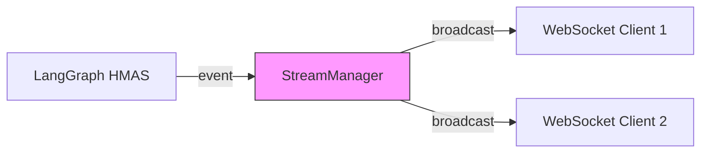

# WebSocket

> LangGraph HMAS 분석 파이프라인의 실시간 진행 상태를 클라이언트에 스트리밍.
> FastAPI WebSocket + `stream_mode="updates"` 기반.

## 아키텍처 위치



## 연결 흐름

```
1. Client: POST /api/v1/jobs/ → job_id 수신
2. Client: WS /api/v1/jobs/{job_id}/stream → 연결 수립
3. Server: LangGraph astream → 노드별 이벤트 발생
4. Server: StreamManager.broadcast(job_id, event) → 연결된 모든 클라이언트에 전송
5. Server: completed 이벤트 → 연결 종료
```

## 문서 목록

| 문서 | 내용 |
|------|------|
| [[websocket/realtime-protocol\|Realtime Protocol]] | WebSocket 메시지 타입, 페이로드, 연결 관리 |

## 문서 목록 (자동)

```dataview
TABLE status, updated, tags
FROM "docs/architecture/interface/websocket"
WHERE file.name != "MOC"
SORT file.name ASC
```

## 관련 ADR

```dataview
LIST
FROM "docs/architecture/decisions"
WHERE contains(impacts, this.file.link)
SORT date DESC
```
