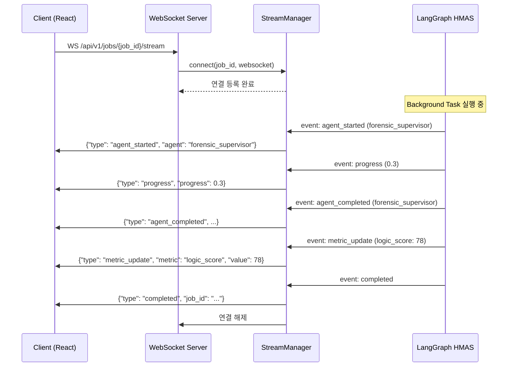

# WebSocket Realtime Protocol

> LangGraph `astream(stream_mode="updates")` 이벤트를 WebSocket으로 클라이언트에 전달하는 프로토콜 정의.

## 연결 수명 주기



## 메시지 타입 정의

| type | 방향 | 설명 | payload |
|------|------|------|---------|
| `agent_started` | Server -> Client | Worker/Supervisor 실행 시작 | `{ agent: string }` |
| `agent_completed` | Server -> Client | Worker/Supervisor 실행 완료 | `{ agent: string, result: object }` |
| `progress` | Server -> Client | 전체 진행률 업데이트 | `{ progress: float (0-1) }` |
| `metric_update` | Server -> Client | 개별 지표 실시간 갱신 | `{ metric: string, value: float }` |
| `error` | Server -> Client | 에러 발생 (Graceful Degradation) | `{ agent: string, message: string }` |
| `completed` | Server -> Client | 전체 분석 완료 | `{ job_id: string }` |

## 메시지 스키마 (TypeScript)

```typescript
// frontend/src/types/websocket.ts

type WSMessageType =
  | 'agent_started'
  | 'agent_completed'
  | 'progress'
  | 'metric_update'
  | 'error'
  | 'completed';

interface WSMessage {
  type: WSMessageType;
  timestamp: string;  // ISO 8601
}

interface AgentStartedMessage extends WSMessage {
  type: 'agent_started';
  agent: string;  // e.g. 'forensic_supervisor', 'ast_analyzer'
}

interface AgentCompletedMessage extends WSMessage {
  type: 'agent_completed';
  agent: string;
  result: {
    summary: string;
    metrics?: Record<string, number>;
    duration_ms: number;
  };
}

interface ProgressMessage extends WSMessage {
  type: 'progress';
  progress: number;  // 0.0 ~ 1.0
  current_phase: string;  // e.g. 'forensic_analysis'
}

interface MetricUpdateMessage extends WSMessage {
  type: 'metric_update';
  metric: 'logic_score' | 'mastery_score' | 'stability_score' | 'authenticity_score';
  value: number;  // 0 ~ 100
}

interface ErrorMessage extends WSMessage {
  type: 'error';
  agent: string;
  message: string;
  is_fatal: boolean;  // false = Graceful Degradation
}

interface CompletedMessage extends WSMessage {
  type: 'completed';
  job_id: string;
}
```

## StreamManager 구현

```python
# interface/websocket/stream_manager.py
from fastapi import WebSocket
from collections import defaultdict
import json

class StreamManager:
    """Job별 WebSocket 연결 관리 + 브로드캐스트."""

    def __init__(self):
        self._connections: dict[str, list[WebSocket]] = defaultdict(list)

    async def connect(self, job_id: str, websocket: WebSocket):
        self._connections[job_id].append(websocket)

    def disconnect(self, job_id: str, websocket: WebSocket):
        self._connections[job_id].remove(websocket)
        if not self._connections[job_id]:
            del self._connections[job_id]

    async def broadcast(self, job_id: str, event: dict):
        """해당 job_id에 연결된 모든 클라이언트에 이벤트 전송."""
        message = json.dumps(event, default=str)
        dead_connections = []
        for ws in self._connections.get(job_id, []):
            try:
                await ws.send_text(message)
            except Exception:
                dead_connections.append(ws)
        for ws in dead_connections:
            self.disconnect(job_id, ws)

# 싱글턴 인스턴스
ws_manager = StreamManager()
```

## 클라이언트 React Hook

```typescript
// frontend/src/hooks/useLangGraphStream.ts
export function useLangGraphStream(jobId: string) {
  const [agentStates, setAgentStates] = useState<AgentState[]>([]);
  const [progress, setProgress] = useState(0);

  useEffect(() => {
    const ws = new WebSocket(`${WS_BASE}/jobs/${jobId}/stream`);

    ws.onmessage = (event) => {
      const data = JSON.parse(event.data);
      switch (data.type) {
        case 'agent_started':
          setAgentStates(prev => [
            ...prev,
            { name: data.agent, status: 'running' }
          ]);
          break;
        case 'agent_completed':
          setAgentStates(prev => prev.map(a =>
            a.name === data.agent
              ? { ...a, status: 'completed', result: data.result }
              : a
          ));
          break;
        case 'progress':
          setProgress(data.progress);
          break;
        case 'metric_update':
          // 실시간 레이더 차트 점진적 렌더링
          break;
      }
    };

    return () => ws.close();
  }, [jobId]);

  return { agentStates, progress };
}
```

## 진행률 산출 기준

| Phase | 비중 | 누적 진행률 |
|-------|------|-----------|
| InputRouter | 5% | 0.05 |
| PlanGenerator | 5% | 0.10 |
| ForensicSupervisor | 25% | 0.35 |
| LogicSupervisor | 15% | 0.50 |
| StackSupervisor | 15% | 0.65 |
| ProfileSynthesizer | 5% | 0.70 |
| QuestionOrchestrator | 15% | 0.85 |
| QualityGate | 5% | 0.90 |
| OutputAssembler | 10% | 1.00 |

## 재연결 전략

| 항목 | 값 |
|------|-----|
| 초기 재연결 딜레이 | 1초 |
| 최대 재연결 딜레이 | 30초 |
| 백오프 배수 | 2x (exponential) |
| 최대 재시도 횟수 | 10회 |
| Heartbeat 간격 | 30초 (Ping/Pong) |

## 관련 문서

- [[interface/rest-api/endpoints]] -- `WS /api/v1/jobs/{job_id}/stream` 엔드포인트
- [[application/hmas-graph/MOC]] -- 이벤트 발생원
- [[interface/d3-charts/four-axis-radar]] -- `metric_update` 메시지로 점진적 렌더링
