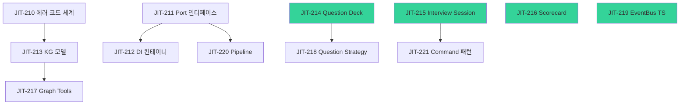

# Phase 1: 도메인 계층 구현 계획

> **기간**: 1.5주 | **티켓**: 12개 (JIT-210 ~ JIT-221)
> **목표**: 순수 비즈니스 로직 + Port 인터페이스 전체 정의

## 마일스톤 M1 완료 기준

- [ ] 모든 Port(Protocol) 정의 완료
- [ ] 에러 코드 체계 동작 (RFC 9457)
- [ ] 도메인 모델 단위 테스트 통과
- [ ] DI 컨테이너 LSP 런타임 검증 통과
- [ ] Phase 2/3 블로커 없음

---

## 의존성 그래프



### 병렬 실행 그룹

| 그룹 | 티켓 | 의존성 | 예상 |
|------|------|--------|------|
| **A (독립)** | JIT-214, 215, 216, 219 | 없음 | 동시 시작 가능 |
| **B (에러)** | JIT-210 → JIT-213 | Phase 0 | 순차 |
| **C (Port)** | JIT-211 → JIT-212, 220 | Phase 0 | 순차 |
| **D (모델→도구)** | JIT-217(←213), 218(←214), 221(←215) | 그룹 A+B | 후순위 |

---

## 티켓별 상세 계획

### JIT-210: 에러 코드 체계 구현
- **산출물**: `shared/errors/base.py`, `codes.py`, `problem_detail.py`
- **아키텍처 참조**: [[crosscutting/error-handling]]
- **실행 순서**: Step 1 (최우선)

### JIT-211: Port 인터페이스 전체 정의
- **산출물**: `shared/ports/stt.py`, `llm.py`, `vad.py`, `audio.py`, `vector.py`, `graph.py`
- **아키텍처 참조**: [[crosscutting/error-handling]], [[application/state-management/reference-passing]]
- **실행 순서**: Step 1 (JIT-210과 병렬)

### JIT-212: AdapterRegistry + DI 컨테이너
- **산출물**: `shared/tools/adapter_registry.py`
- **아키텍처 참조**: [[crosscutting/error-handling]]
- **실행 순서**: Step 2 (JIT-211 완료 후)

### JIT-213: KG 도메인 모델
- **산출물**: `backend/src/domain/models/knowledge_graph.py`
- **아키텍처 참조**: [[domain/knowledge-graph/MOC]], [[domain/knowledge-graph/node-types]], [[domain/knowledge-graph/edge-types]]
- **실행 순서**: Step 1 (독립)

### JIT-214: Question Deck 도메인 모델
- **산출물**: `backend/src/domain/models/question.py`
- **아키텍처 참조**: [[application/live-session/three-layer-questions]]
- **실행 순서**: Step 1 (독립)

### JIT-215: Interview Session 도메인 모델
- **산출물**: `backend/src/domain/models/interview.py`
- **아키텍처 참조**: [[application/live-session/MOC]], [[application/live-session/live-engine]]
- **실행 순서**: Step 1 (독립)

### JIT-216: Scorecard + Report 도메인 모델
- **산출물**: `backend/src/domain/models/scorecard.py`
- **아키텍처 참조**: [[application/live-session/post-interview-graph]]
- **실행 순서**: Step 1 (독립)

### JIT-217: Graph Tool Set 인터페이스
- **산출물**: `shared/ports/graph_tools.py`
- **아키텍처 참조**: [[domain/knowledge-graph/graph-tools]]
- **실행 순서**: Step 2 (JIT-213 완료 후)

### JIT-218: Question Strategy 인터페이스
- **산출물**: `backend/src/domain/strategies/question_strategy.py`
- **아키텍처 참조**: [[application/live-session/three-layer-questions]]
- **실행 순서**: Step 2 (JIT-214 완료 후)

### JIT-219: EventBus 타입 정의 (TypeScript)
- **산출물**: `desktop/src/types/events.ts`, `shared/types/events.ts`
- **아키텍처 참조**: [[interface/electron-app/architecture]]
- **실행 순서**: Step 1 (독립)

### JIT-220: Pipeline 프레임워크
- **산출물**: `shared/tools/pipeline.py`, `desktop/src/services/pipeline.ts`
- **아키텍처 참조**: [[application/live-session/live-engine]]
- **실행 순서**: Step 2 (JIT-211 완료 후)

### JIT-221: Command 패턴 기반 명령 체계
- **산출물**: `backend/src/domain/commands/`, `desktop/src/commands/`
- **아키텍처 참조**: [[application/live-session/live-engine]]
- **실행 순서**: Step 2 (JIT-215 완료 후)

---

## 실행 타임라인

```
Day 1-2 (Step 1 병렬):
  ├── JIT-210: 에러 코드 체계
  ├── JIT-211: Port 인터페이스
  ├── JIT-213: KG 도메인 모델
  ├── JIT-214: Question Deck 모델
  ├── JIT-215: Interview Session 모델
  ├── JIT-216: Scorecard 모델
  └── JIT-219: EventBus TS

Day 3-4 (Step 2 — 의존성 해결 후):
  ├── JIT-212: DI 컨테이너 (← JIT-211)
  ├── JIT-217: Graph Tools (← JIT-213)
  ├── JIT-218: Question Strategy (← JIT-214)
  ├── JIT-220: Pipeline (← JIT-211)
  └── JIT-221: Command 패턴 (← JIT-215)

Day 5 (통합):
  └── 전체 도메인 테스트 + M1 체크
```

---

## 아키텍처 문서 매핑

| 티켓 | 관련 아키텍처 문서 |
|------|-------------------|
| JIT-210 | [[crosscutting/error-handling]] |
| JIT-211 | [[crosscutting/error-handling]], [[application/state-management/reference-passing]] |
| JIT-212 | [[crosscutting/error-handling]] |
| JIT-213 | [[domain/knowledge-graph/MOC]], [[domain/knowledge-graph/node-types]], [[domain/knowledge-graph/edge-types]] |
| JIT-214 | [[application/live-session/three-layer-questions]] |
| JIT-215 | [[application/live-session/MOC]], [[application/live-session/live-engine]] |
| JIT-216 | [[application/live-session/post-interview-graph]] |
| JIT-217 | [[domain/knowledge-graph/graph-tools]] |
| JIT-218 | [[application/live-session/three-layer-questions]] |
| JIT-219 | [[interface/electron-app/architecture]] |
| JIT-220 | [[application/live-session/live-engine]] |
| JIT-221 | [[application/live-session/live-engine]] |

---

## Dataview 쿼리

```dataview
TABLE linear, status, tags
FROM "docs/architecture"
WHERE contains(tags, "phase-1") OR contains(linear, "JIT-21")
SORT linear ASC
```
