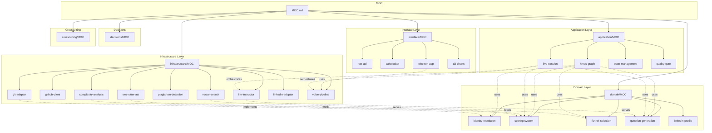

# Jittda v5.0 통합 아키텍처 문서 설계

> **작성일**: 2026-02-19
> **상태**: approved
> **범위**: v5.0 HMAS + Jittda Live 통합 설계
> **산출물**: `docs/architecture/` Obsidian Vault (~77개 문서)

---

## 1. 설계 결정 요약

| 항목 | 결정 |
|------|------|
| 설계 범위 | v5.0 + Live 통합 (3-Phase Lifecycle) |
| Vault 위치 | `docs/architecture/` (Git 추적) |
| 문서 구조 | DDD 4계층 (domain/application/infrastructure/interface) |
| 링킹 방식 | Obsidian `[[wikilinks]]` + YAML frontmatter |
| 관계 매핑 | `depends-on`, `affects`, `parent`, `children`, `impacts` |
| 자동 인덱싱 | Dataview 쿼리 (MOC 노트) |
| 의존성 그래프 | RELATION-MAP.md (Mermaid) |
| ADR 형식 | MADR v4 + YAML frontmatter |
| MCP 서버 | cyanheads/obsidian-mcp-server |
| 기존 문서 | 새 Vault에 흡수하여 재구성 (기존은 레거시 참조) |

---

## 2. Vault 전체 구조

```
docs/architecture/                    ← Obsidian Vault 루트
│
├── .obsidian/                        ← Obsidian 설정
│   └── community-plugins.json
│
├── MOC.md                            ← 최상위 진입점 (Map of Contents)
├── RELATION-MAP.md                   ← 전체 의존성 그래프 (Mermaid)
│
├── domain/                           ← [L3] 순수 비즈니스 로직
│   ├── MOC.md
│   ├── identity-resolution/
│   │   ├── MOC.md
│   │   ├── overview.md               ← 3단계 포렌식 전체 설명
│   │   ├── github-node-id.md         ← Step 1 상세
│   │   ├── dynamic-mailmap.md        ← Step 2 상세
│   │   ├── blame-forensics.md        ← Step 3 상세
│   │   └── models.md                 ← Pydantic 모델 정의
│   ├── scoring-system/
│   │   ├── MOC.md
│   │   ├── four-metrics.md           ← 4대 지표 체계
│   │   ├── logic-metric.md           ← 논리력 30% 상세
│   │   ├── mastery-metric.md         ← 전문성 30%
│   │   ├── stability-metric.md       ← 안정성 20%
│   │   ├── authenticity-metric.md    ← 진정성 20%
│   │   └── confidence-levels.md      ← 신뢰도 체계
│   ├── funnel-selection/
│   │   ├── MOC.md
│   │   ├── hard-filter.md            ← Stage 1: 메타데이터 필터
│   │   ├── relevance-scoring.md      ← Stage 2: LLM 선별
│   │   └── vector-similarity.md      ← Stage 3: 코사인 유사도
│   ├── question-generation/
│   │   ├── MOC.md
│   │   ├── three-strategies.md       ← 3전략 개요
│   │   ├── negative-selection.md     ← 전략 A
│   │   ├── intentional-complexity.md ← 전략 B
│   │   └── code-evolution.md         ← 전략 C
│   └── linkedin-profile/
│       ├── MOC.md
│       └── profile-model.md
│
├── application/                      ← [L2] LangGraph 오케스트레이션
│   ├── MOC.md
│   ├── hmas-graph/
│   │   ├── MOC.md
│   │   ├── meta-agent.md             ← Level 1 총괄
│   │   ├── forensic-supervisor.md    ← Level 2
│   │   ├── logic-supervisor.md
│   │   ├── stack-supervisor.md
│   │   ├── execution-flow.md         ← 병렬/순차 흐름
│   │   └── conditional-edges.md      ← 분기 로직
│   ├── live-session/
│   │   ├── MOC.md
│   │   ├── pre-interview-graph.md    ← Phase 1: 사전 분석
│   │   ├── live-engine.md            ← Phase 2: 실시간 (비-LangGraph)
│   │   ├── post-interview-graph.md   ← Phase 3: 사후 분석
│   │   └── three-layer-questions.md  ← 3계층 질문 전략
│   ├── state-management/
│   │   ├── MOC.md
│   │   ├── reference-passing.md      ← DB ID만 전달 패턴
│   │   ├── meta-state.md             ← MetaState TypedDict
│   │   └── checkpoint-schema.md      ← LangGraph 체크포인트
│   └── quality-gate/
│       ├── MOC.md
│       └── review-loop.md            ← 조건부 2회 루프
│
├── infrastructure/                   ← [L4] 외부 서비스 어댑터
│   ├── MOC.md
│   ├── git-adapter/
│   │   ├── MOC.md
│   │   ├── clone-strategy.md
│   │   ├── blame-extraction.md
│   │   └── mailmap-generation.md
│   ├── github-client/
│   │   ├── MOC.md
│   │   ├── graphql-api.md
│   │   └── rest-api.md
│   ├── tree-sitter-ast/
│   │   ├── MOC.md
│   │   ├── parser-setup.md           ← 0.25.x 변경사항 반영
│   │   ├── language-support.md       ← 5개 언어
│   │   └── query-cursor-api.md       ← 0.25 신규 API
│   ├── complexity-analysis/
│   │   ├── MOC.md
│   │   ├── radon.md
│   │   ├── lizard.md
│   │   └── sonarqube.md
│   ├── plagiarism-detection/
│   │   ├── MOC.md
│   │   └── datasketch-minhash.md
│   ├── llm-instructor/
│   │   ├── MOC.md
│   │   ├── instructor-setup.md       ← 1.14.5 from_provider()
│   │   ├── langfuse-integration.md
│   │   └── prompt-management.md
│   ├── vector-search/
│   │   ├── MOC.md
│   │   ├── pgvector-setup.md         ← 0.8.1 iterative_scan
│   │   └── embedding-strategy.md
│   ├── linkedin-adapter/
│   │   ├── MOC.md
│   │   └── brightdata-scraper.md
│   └── voice-pipeline/               ← Live 전용
│       ├── MOC.md
│       ├── vad-silero.md
│       ├── stt-provider.md           ← Deepgram 대체 검토
│       ├── tts-provider.md
│       └── groq-realtime.md          ← 0.35s TTFT
│
├── interface/                        ← [L1] API + UI
│   ├── MOC.md
│   ├── rest-api/
│   │   ├── MOC.md
│   │   ├── endpoints.md
│   │   └── schemas.md
│   ├── websocket/
│   │   ├── MOC.md
│   │   └── realtime-protocol.md
│   ├── electron-app/                 ← Live 클라이언트
│   │   ├── MOC.md
│   │   ├── architecture.md           ← Main/Renderer/Child Process
│   │   ├── audio-capture.md          ← OS별 네이티브
│   │   ├── lancedb-local.md          ← 로컬 벡터 DB
│   │   └── tauri-migration.md        ← Tauri 2.x 검토
│   └── d3-charts/
│       ├── MOC.md
│       ├── four-axis-radar.md
│       ├── complexity-treemap.md
│       ├── ai-code-heatmap.md
│       └── skill-heatmap.md
│
├── decisions/                        ← ADR (MADR v4)
│   ├── MOC.md                        ← Dataview 자동 인덱스
│   ├── adr-template.md
│   ├── 0001-langgraph-over-temporal.md
│   ├── 0002-clean-slate-not-migration.md
│   ├── 0003-ddd-four-layers.md
│   ├── 0004-reference-passing.md
│   ├── 0005-instructor-pydantic.md
│   ├── 0006-tree-sitter-025.md
│   ├── 0007-pgvector-iterative-scan.md
│   ├── 0008-stt-korean-alternative.md
│   └── 0009-electron-vs-tauri.md
│
├── crosscutting/                     ← 횡단 관심사
│   ├── MOC.md
│   ├── security.md
│   ├── performance.md
│   ├── monitoring.md
│   ├── error-handling.md
│   ├── testing-strategy.md
│   ├── deployment.md                 ← Docker + Cloudflare Tunnel
│   └── data-availability-tiers.md    ← Platinum/Gold/Silver
│
├── tech-stack/                       ← 기술 스택 레지스트리
│   ├── MOC.md
│   ├── backend.md
│   ├── frontend.md
│   ├── infrastructure.md
│   └── version-matrix.md            ← 전체 버전 매트릭스
│
└── templates/                        ← Templater 템플릿
    ├── adr-template.md
    ├── component-template.md
    └── moc-template.md
```

---

## 3. YAML Frontmatter 표준

### 3.1 공통 필드 (모든 문서)

```yaml
---
title: "문서 제목"
type: domain | application | infrastructure | interface | adr | crosscutting | tech
status: draft | review | approved | deprecated
created: 2026-02-19
updated: 2026-02-19
tags: [langgraph, hmas, orchestration]

# 계층 관계
parent: "[[application/MOC]]"
children:
  - "[[hmas-graph/meta-agent]]"
  - "[[hmas-graph/forensic-supervisor]]"

# 의존성 관계
depends-on:
  - "[[decisions/0001-langgraph-over-temporal]]"
  - "[[domain/scoring-system/four-metrics]]"

# 영향 관계
affects:
  - "[[crosscutting/testing-strategy]]"
  - "[[interface/websocket/realtime-protocol]]"

# Linear 티켓 매핑
linear: ["JIT-100", "JIT-101"]
phase: 3
---
```

### 3.2 ADR 전용 필드 (MADR v4)

```yaml
---
title: "ADR-0001: LangGraph over Temporal"
type: adr
status: accepted          # proposed | accepted | deprecated | superseded
date: 2026-02-15
decision-makers: ["@sabyun"]
supersedes: []
superseded-by: []
related-adrs:
  - "[[decisions/0003-ddd-four-layers]]"
  - "[[decisions/0004-reference-passing]]"
impacts:
  - "[[application/hmas-graph/MOC]]"
  - "[[application/state-management/checkpoint-schema]]"
---
```

### 3.3 MOC 전용

```yaml
---
title: "Domain Layer"
type: moc
layer: domain
---
```

### 3.4 관계 타입 요약

| frontmatter 키 | 방향 | 의미 |
|----------------|------|------|
| `parent` | ↑ 상위 | 이 문서의 상위 MOC |
| `children` | ↓ 하위 | 이 문서가 포함하는 하위 문서 |
| `depends-on` | → 참조 | 이 문서가 의존하는 문서/ADR |
| `affects` | → 영향 | 이 문서 변경 시 영향받는 문서 |
| `supersedes` | → 대체 | (ADR) 이전 결정 대체 |
| `impacts` | → 적용 | (ADR) 적용되는 컴포넌트 |
| `linear` | → 외부 | Linear 티켓 ID |

---

## 4. Dataview 자동 인덱싱

### 변경 영향 분석

```dataview
LIST
FROM "docs/architecture"
WHERE contains(depends-on, this.file.link)
   OR contains(affected-by, this.file.link)
```

### ADR 대시보드

```dataview
TABLE status, date, decision-makers, impacts
FROM "docs/architecture/decisions"
WHERE type = "adr"
SORT date DESC
```

### 스테일 문서 탐지

```dataview
TABLE updated, status, tags
FROM "docs/architecture"
WHERE date(updated) < date(today) - dur(30 days)
  AND status != "deprecated"
SORT updated ASC
```

### Phase별 진행 현황

```dataview
TABLE status, linear, tags
FROM "docs/architecture"
WHERE phase = 3
SORT status ASC
```

---

## 5. 통합 아키텍처 — 3-Phase Lifecycle

### 5.1 전체 시스템 개요

```
Phase 1: PRE-INTERVIEW     Phase 2: LIVE INTERVIEW    Phase 3: POST-INTERVIEW
(서버 — LangGraph HMAS)    (클라이언트 — Electron)    (서버 — LangGraph)

JD + GitHub URL             Question Deck ◀──┐         Interview Log
     │                      Profile     ◀────┤              │
     ▼                      GraphRAG    ◀────┘              ▼
[HMAS Pipeline]                  │                    [Evaluation]
     │                           ▼                          │
     ▼                     [Live Engine]                    ▼
DB 저장 ── 동기화 ──▶ LanceDB(로컬)  ── 업로드 ──▶  [Report + D3]
```

### 5.2 Phase 1: Pre-Interview (서버 — LangGraph HMAS)

```
MetaAgent (Level 1)
├─ InputRouter → PlanGenerator
├─ AnalysisDispatcher (Fan-out)
│   ├─ ForensicSupervisor (Level 2) ──── 병렬 ────┐
│   │   ├─ CollectorWorker (W1)                    │
│   │   ├─ IdentityResolver                       │
│   │   ├─ SemanticPruner                          │
│   │   └─ [Vibector, CLAVE, Datasketch]           │
│   ├─ LogicSupervisor (Level 2) ──── 병렬 ───────┤
│   │   ├─ ASTAnalyzerWorker (W6)                  │
│   │   ├─ ComplexityMeterWorker (W7)              │
│   │   └─ QualityScannerWorker (W8)               │
│   └─ StackSupervisor (Level 2) ── Logic 완료 후 ─┘
│       ├─ SkillExtractorWorker (W9)
│       ├─ APIDepthAnalyzerWorker (W10)
│       └─ ArchitectureEvaluatorWorker (W11)
├─ ProfileSynthesizer (Fan-in) → 4대 지표 산출
├─ QuestionOrchestrator → Question Deck (20~30장)
│   ├─ 전략 A: Negative Selection
│   ├─ 전략 B: Intentional Complexity
│   └─ 전략 C: Code Evolution
├─ QualityGate (조건부 루프 max 2회)
│   └─ Enhancement Agents (5개 병렬)
└─ OutputAssembler → DB 저장 + Electron 동기화
```

### 5.3 Phase 2: Live Interview (클라이언트 — Electron/Tauri)

LangGraph 사용하지 않음 — 지연 최소화를 위해 로컬 엔진.

```
Audio Pipeline: 마이크/시스템 → VAD(Silero) → STT → 텍스트

3-Layer Question Engine:
  Layer 1: Question Deck (0ms) — 사전 생성 카드 순차 제시
  Layer 2: Dynamic Probing (~0.8s) — LanceDB + Groq API 꼬리 질문
  Layer 3: Reaction & Control (~0.2s) — 로컬 Llama 즉각 반응

Interviewer Dashboard:
  - 토픽 커버리지 바
  - 동적 검증 질문 카드
  - 실시간 스코어카드
```

### 5.4 Phase 3: Post-Interview (서버 — LangGraph)

```
Interview Log 업로드
├─ [병렬] Evaluator (점수 합산) + Ranker (백분위)
├─ Reporter → D3.js 시각화 데이터 (JSON)
│   ├─ FourAxisRadar, ComplexityTreemap
│   ├─ AICodeHeatmap, SkillHeatmap
│   └─ 면접 종합 서술 (비개발자용)
└─ ResultPage 데이터: Overview / Code Deep Dive / Interview 탭
```

### 5.5 핵심 설계 원칙

| 원칙 | 적용 |
|------|------|
| Reference Passing | State에는 DB ID만 전달. Raw 데이터는 DB에 |
| 사전 연산 | GraphRAG, 벡터 임베딩은 Phase 1에서 완료 → Phase 2에서 읽기만 |
| DDD 의존성 규칙 | Domain ← Application, Domain ← Infrastructure (역방향 금지) |
| 데이터 가용성 Tier | Platinum/Gold/Silver — 데이터 부족해도 서비스 동작 |
| Fact-Grounded LLM | 모든 LLM 판단에 정량적 분석 데이터 근거 필수 |
| Noise-Free Analysis | Fork 제외, AI 생성 코드 제거, 순수 기여분만 분석 |

---

## 6. 기술 스택 업데이트 (2026.02 최신)

### 6.1 v5 설계서 대비 변경점

| 패키지 | v5 설계서 | 최종 채택 | 변경 사유 |
|--------|----------|----------|----------|
| tree-sitter | >=0.24.7 | **>=0.25.2** | `QueryCursor` API, ABI v15 Breaking Change |
| instructor | >=1.7.0 | **>=1.14.0** | `from_provider()` 통합 API |
| pgvector (DB) | 미명시 | **0.8.1** | `iterative_scan` 9.4x 성능 향상 |
| LanceDB | v0.26 | **v0.29.2** | Lance SDK 1.0 GA |
| STT | Deepgram Nova-3 | **Whisper large-v3** | Deepgram 한국어 미지원 |
| Desktop | Electron v33 | **Electron v33 / Tauri 2.x (ADR 결정)** | Tauri 96% 번들 감소 |

### 6.2 Breaking Changes 요약

**Tree-sitter 0.24 → 0.25:**
```python
# 구형: query = language.query("..."); captures = query.captures(node)
# 신형: query = Query(language, "..."); cursor = QueryCursor(query); captures = cursor.captures(node)
```

**Instructor 1.7 → 1.14:**
```python
# 구형: client = instructor.patch(openai.OpenAI())
# 신형: client = instructor.from_provider("openai/gpt-4o-mini")
```

**pgvector Iterative Scan (init.sql 추가):**
```sql
SET hnsw.iterative_scan = 'relaxed_order';
```

### 6.3 ADR 후보

| ADR | 제목 | 상태 |
|-----|------|------|
| 0006 | Tree-sitter 0.25.x 업그레이드 | proposed |
| 0007 | pgvector Iterative Scan 활성화 | accepted |
| 0008 | 한국어 STT: Whisper vs Clova | proposed |
| 0009 | Electron vs Tauri 2.x | proposed |
| 0010 | Groq를 Kimi K2.5 서빙 백엔드로 | proposed |

---

## 7. MCP 통합 — Obsidian 워크플로우

### 7.1 서버 설정

**cyanheads/obsidian-mcp-server** — `.mcp.json` 추가:
```json
{
  "mcpServers": {
    "obsidian": {
      "command": "npx",
      "args": ["-y", "obsidian-mcp-server"],
      "env": {
        "OBSIDIAN_API_KEY": "${OBSIDIAN_API_KEY}",
        "OBSIDIAN_BASE_URL": "http://127.0.0.1:27123",
        "OBSIDIAN_VERIFY_SSL": "false",
        "OBSIDIAN_ENABLE_CACHE": "true",
        "OBSIDIAN_CACHE_TTL": "600"
      }
    }
  }
}
```

### 7.2 사전 준비

1. Obsidian에서 `docs/architecture/`를 Vault로 열기
2. Community Plugin: **Local REST API** 설치 + 활성화 + API Key 생성
3. 필수 플러그인: Dataview, Templater, Obsidian Git, Folder Note

### 7.3 MCP 도구 (8개)

| 도구 | 용도 |
|------|------|
| `obsidian_read_note` | 문서 + frontmatter 읽기 |
| `obsidian_update_note` | 내용 수정 (append/prepend/overwrite) |
| `obsidian_list_notes` | 디렉토리 탐색 |
| `obsidian_global_search` | Vault 전체 검색 |
| `obsidian_search_replace` | 텍스트 치환 |
| `obsidian_manage_frontmatter` | YAML 키 원자적 get/set/delete |
| `obsidian_manage_tags` | 태그 add/remove/list |
| `obsidian_delete_note` | 문서 삭제 |

### 7.4 워크플로우

```
구현 중 설계 변경 발생
  → obsidian_global_search로 관련 문서 검색
  → obsidian_read_note로 frontmatter 확인
  → obsidian_manage_frontmatter로 status 변경
  → obsidian_update_note로 내용 업데이트
  → affects 목록 순회하며 연관 문서도 status → "review"
```

---

## 8. RELATION-MAP — 전체 의존성 그래프



---

## 9. 문서 작성 로드맵

### 작성 순서 — 의존성 기반

| Wave | 내용 | 문서 수 | 완료 기준 |
|------|------|---------|----------|
| 1 | 골격 (MOC, 템플릿, RELATION-MAP) | ~8 | Dataview 쿼리 동작 확인 |
| 2 | ADR 핵심 결정 (0001~0009) | ~9 | 상호 링크 완성 |
| 3 | Domain Layer 전체 | ~15 | Pydantic 정의, 계산 공식 |
| 4 | Infrastructure Layer 전체 | ~15 | 코드 예시, Breaking Change |
| 5 | Application Layer 전체 | ~10 | Mermaid 그래프, State 정의 |
| 6 | Interface Layer 전체 | ~10 | API 엔드포인트, UI 와이어프레임 |
| 7 | Crosscutting + Tech Stack | ~10 | 배포 다이어그램, 테스트 전략 |

**총 ~77개 문서, 7 Wave**

### 문서 작성 규칙

1. 항상 frontmatter 먼저 — 내용보다 관계 매핑이 우선
2. MOC는 Dataview로만 — 수동 목차 금지
3. 코드 예시 필수 — 추상 설명만 금지
4. ADR 참조 필수 — 모든 설계 결정에 ADR wikilink
5. Linear 티켓 매핑 — `linear: ["JIT-xxx"]`
6. Git 커밋 단위 — Wave별 커밋

---

## 10. Obsidian 플러그인 스택

| 플러그인 | 용도 |
|---------|------|
| Local REST API | MCP 서버 통신 (포트 27123) |
| Dataview | 자동 인덱싱, 관계 쿼리 |
| Templater | 문서 템플릿 자동화 |
| Obsidian Git | 자동 커밋/푸시 |
| Folder Note | 폴더 = MOC 노트 |

`.obsidian/community-plugins.json`:
```json
["dataview", "templater-obsidian", "obsidian-git", "folder-note-core", "obsidian-local-rest-api"]
```
